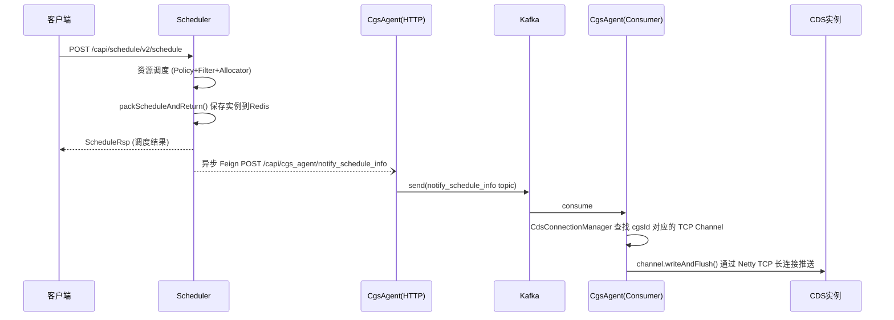
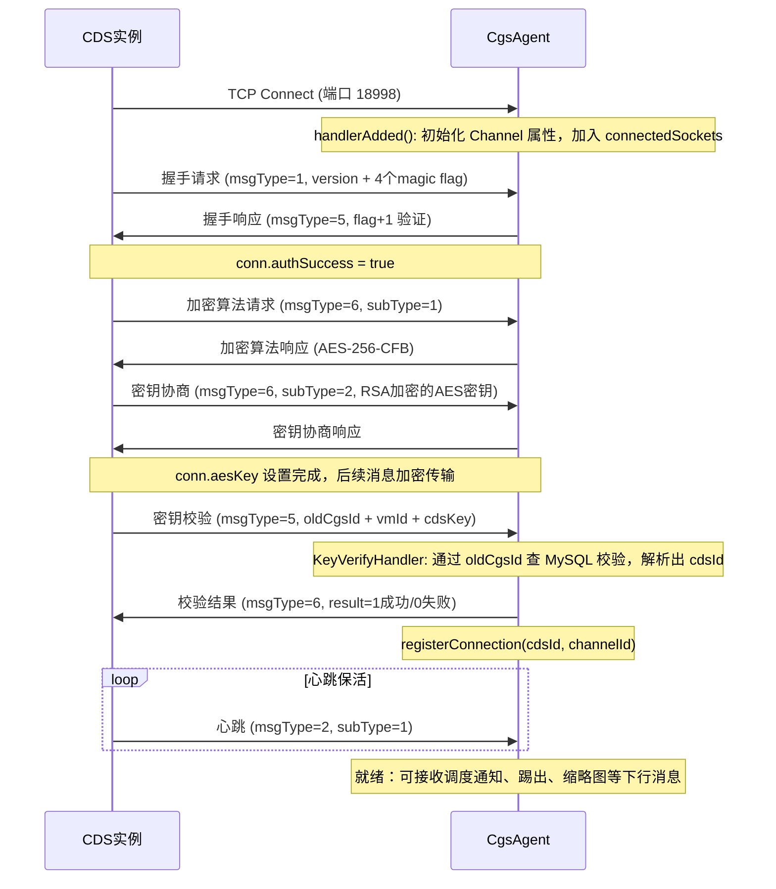

# 调度系统全链路架构设计

## 模块定位

调度系统由 **Scheduler** 和 **CgsAgent** 两个服务组成，共同完成从用户请求到 CDS 实例接收调度指令的全链路：

- **Scheduler**：调度决策中心，负责资源调度分配、代理树管理、用户会话管理、CDS Key 签名校验，并将调度结果推送给 CgsAgent。
- **CgsAgent**：消息代理网关，接收 Scheduler 的调度指令，通过 Netty TCP 长连接下发到远端 CDS 实例。

## Scheduler 目录结构

```
src/backend/cds/
├── core/scheduler/                    # 核心模块
│   ├── api-scheduler/                 # REST 接口定义（JAX-RS Interface）
│   │   └── api/                       # SchedulerResource, ProxyCacheResource 等
│   ├── biz-scheduler/                 # 业务实现
│   │   ├── config/                    # Kafka、数据源等配置
│   │   ├── dao/                       # 数据访问层（JOOQ）
│   │   │   └── impl/
│   │   │       ├── dbcloudgame/       # cloudgame 数据源的 DAO 实现
│   │   │       └── dbscheduler/       # scheduler 数据源的 DAO 实现
│   │   ├── redis/                     # Redis 操作工具类
│   │   ├── resources/                 # 接口实现类（ResourceImpl）
│   │   ├── schedule/                  # ★ 调度核心逻辑
│   │   │   ├── alloctor/             # 资源分配器（CdsAllocator）
│   │   │   ├── filter/               # 资源过滤器（CDS 维度）
│   │   │   ├── policy/               # 调度策略
│   │   │   └── proxy/                # 代理树相关（TreeBuilder、ProxyFilter）
│   │   ├── service/                   # 服务层
│   │   ├── client/                    # 远程服务调用
│   │   └── util/                      # 工具类（Caffeine 缓存管理器）
│   ├── model-scheduler/               # JOOQ 生成的数据模型
│   └── boot-scheduler/                # Spring Boot 启动入口
└── ext/tencent/scheduler/             # 腾讯扩展层
    ├── api-scheduler-tencent/
    ├── biz-scheduler-tencent/
    └── boot-scheduler-tencent/        # 实际部署入口 Application.kt
```

## Scheduler 内部调度流程

```
客户端请求 → SchedulerResource(/capi/schedule/v2/schedule)
         → SchedulerService.cdsScheduler()
         │
         ├─ 1. Redis 获取 UserAccessInfo（通过 startToken）
         ├─ 2. EngineServiceClient 获取 CDS 绑定信息
         ├─ 3. AssignmentCheckService 检查是否已有实例（快速返回）
         ├─ 4. 观察者调度：若 CDS 已有用户，复用其调度结果
         └─ 5. AllocService.directAlloc() 执行资源分配
              │
              ├─ 分布式锁：RedisLock("alloc_{userId}_{cdsId}")
              └─ PolicyManager 编排执行：
                   ├─ ParamCheckPolicy → 参数校验
                   └─ NormalSearchPolicy → 过滤 + 分配
                        ├─ FilterManager: ProxyAllocFilter → CdsWhiteListFilter
                        │                → SingleInstanceFilter → RedisZsetFilter
                        └─ AllocatorManager: CdsAllocator
```

## 全链路调度数据流

从客户端发起调度请求，到 CDS 实例收到调度通知的完整链路：



### 调度结果推送链路

调度完成后，Scheduler 异步将调度信息推送到 CgsAgent：

```
AssignmentCheckService.packScheduleAndReturn()
  │
  ├─ 生成 resourceToken，保存到 Redis
  ├─ SchedulerUserService.saveAllocatedGameInstance() → 保存实例到 UserSession
  │
  └─ SchedulerUserService.pushScheduleInfo()  ← 异步 executor.submit
       │
       ├─ 组装 NotifyScheduleInfoReq（含 userId, sessionId, sessionKey, cgsId, 资源信息等）
       │   ├─ WEBRTC 模式下：`NotifyScheduleInfoReq.proxyEndpoint` 使用 Proxy `cds_endpoint`；
       │   │  其他模式：继续使用客户端 `proxyEndpoint`
       │   └─ WEBRTC 调度还会经代理树过滤：`SchedulerService.buildAllocationRequest()` 在 `scheduleMode == WEBRTC` 时向 `proxyTags` 注入 `webrtc`，`ProxyTreeFilter.handleWebRtc(proxyTags)` 与 `TreeBuilder.handleWebRtc` 按标签与 Proxy 侧 `webrtc` 做对称互斥（仅带请求标签时命中带标签池，否则仅命中无标签池；无匹配时不降级）
       ├─ client.get(CdsAgentResource::class).notifyScheduleInfo(req)  ← Feign HTTP 调用
       │
       └─ 附带 fetchDesktopThumbnail 请求（如果有配置）
```

`NotifyScheduleInfoReq` 携带的关键数据：userId、sessionId、sessionKey、cgsId、cpuId、gpuId、encoderId、instanceId、proxyEndpoint、expectedAction、encoderConfig 等全量调度信息。其中 `proxyEndpoint` 是发送给 CDS 的长连接地址，`WEBRTC` 模式优先取 Proxy `cds_endpoint`，其他模式保持客户端 `proxyEndpoint`。

## 标准化搜索画像与调度埋点

Scheduler 在 `fresh_alloc` 路径中记录标准化搜索画像，供下游分析（Report 规则引擎 + LLM）使用。

### 数据模型

| 类                        | 路径                                          | 职责                                                                                             |
| ------------------------- | --------------------------------------------- | ------------------------------------------------------------------------------------------------ |
| `SearchProfile`           | `schedule/profile/SearchProfile.kt`           | 不可变画像（`RequestProfile` / `TreeSearchProfile` / `FilterOutcomeProfile` / `DecisionSource`） |
| `MutableSearchProfile`    | `schedule/profile/SearchProfile.kt`           | 热路径内可变画像对象，含各阶段 `*_executed` 布尔标记                                             |
| `SearchProfileBuilder`    | `schedule/profile/SearchProfileBuilder.kt`    | 标准化逻辑和 profile signature 生成                                                              |
| `ScheduleProfileRecorder` | `schedule/profile/ScheduleProfileRecorder.kt` | 将画像、原因码、漏斗和执行计数写入 Redis                                                         |

### 执行流程

```
fresh_alloc 路径：
  ScheduleContext.searchProfile 初始化（ProxyAllocFilter）
    → 各 Filter/Allocator 设置 *_executed = true
    → ProxyTreeFilter 记录 primary/backup/degrade 结果数 + reason code
    → ProxyNormalAllocator 记录 finalSelectionMethod + selectedProxyIp
    → ScheduleProfileRecorder.record()
        → Redis HINCRBY:
           s_schedule_profile_dist_{zoneId}_{ts}      画像签名分布
           s_schedule_filter_reason_{zoneId}_{ts}      原因码统计
           s_schedule_trace_{zoneId}_{ts}              漏斗数据 + *_executed_count
           s_schedule_decision_source_{zoneId}_{ts}    决策来源统计
```

### 设计约束

- **仅 fresh_alloc**：`existing_assignment` 和 `observer_reuse` 不混入画像/漏斗统计，只记录 `decisionSource`
- **热路径轻量**：调度过程只做内存赋值和少量 Redis `HINCRBY`，不做聚合/分析
- **分析时深度**：聚合、规则引擎和树模拟在 Report 服务的分析 API 中执行

## 核心设计模式

### 策略-过滤器-分配器 三层调度架构

调度核心使用 **Policy + Filter + Allocator** 三层抽象，通过 Builder 模式组装：

```kotlin
// 三个核心接口，均继承 Operator
interface Policy : Operator {
    fun execute(context: ScheduleContext): Any?
}

interface ResourceFilter : Operator {
    fun filter(context: ScheduleContext, inList: List<String>): List<String>
}

interface Allocator : Operator {
    fun alloc(context: ScheduleContext, inList: List<String>): Any
}
```

**组装方式**（在 `AllocService.directAlloc` 中）：

```kotlin
PolicyManager.newBuild()
    .add(paramCheckPolicy, null)                           // 策略1：参数校验，无分配器
    .add(normalSearchPolicy, cdsAllocator,                 // 策略2：搜索+分配
         proxyAllocFilter, cdsWhiteListFilter,
         singleInstanceFilter, redisZsetFilter)
    .build()
    .run(directAllocRequest)
```

**执行逻辑**：PolicyManager 按顺序执行 Policy，每个 Policy 内部通过 FilterManager 串联过滤器，最终由 AllocatorManager 完成分配。

### 代理树（Proxy Tree）

`TreeBuilder` 构建多级树形索引，用于快速匹配代理节点：

```
Zone → Status → Telecom → NetworkType → OSType → DeviceType → GameId → ... → SingleSidedNetwork → WebRtc
```

- `WebRtc` 层与 `webrtc` Proxy 标签对应；`WEBRTC` 调度在入口将模式翻译为 `proxyTags` 中的 `webrtc` 后，经 `ProxyTreeFilter.handleWebRtc` + `TreeBuilder.handleWebRtc` 与 `single_sided_network` 范式对称互斥过滤（详见 `docs-harness/architecture/scheduler.md`「WEBRTC 标签隔离」）。
- 使用 Caffeine 本地缓存（maxSize=2000, expire=10min）
- 通过 Kafka 广播实现多节点缓存刷新

### Proxy 过滤器链

代理维度的过滤器链在 `NormalSearchPolicy` 中通过 `filterMapMgr` 组装：

| 过滤器                     | 职责                                                                                                                                                                     |
| -------------------------- | ------------------------------------------------------------------------------------------------------------------------------------------------------------------------ |
| `ProxyTreeFilter`          | 代理树匹配（含 `webrtc` 维度：`proxyTags` 注入标签后与 `single_sided_network` 对称的过滤路径）                                                                           |
| `ProxyAppPermissionFilter` | 应用权限过滤                                                                                                                                                             |
| `ProxyTagFilter`           | 扩展标签：白名单 **all-of**（`op:`/`biz:`/`feat:`）+ 二期 **none-of**（`!op:`/`!biz:`/`!feat:`）；`req` 与 `t_proxy_ext_tag`；总开关 `strategy.proxy_tag_filter.enabled` |
| `ProxyIsoTagFilter`        | `iso:*` **双向严格相等**（`reqIso == proxyIso`）；总开关 `strategy.proxy_iso_tag_filter.enabled`（默认 true）                                                            |
| `ProxyRedisZsetFilter`     | Redis 指标过滤（评分、带宽）                                                                                                                                             |
| `ProxyCdsDialScoreFilter`  | 拨测评分过滤                                                                                                                                                             |
| `ProxyTelecomFilter`       | 运营商匹配                                                                                                                                                               |

**数据源解耦**：`ProxyTagFilter` / `ProxyIsoTagFilter` 与 `ProxyTreeFilter` 数据源分离：`t_proxy.tags` 仅供 `TreeBuilder` 树过滤；两过滤器经 `ExtTableProxyTagsProvider → ProxyExtTagCacheManager` 读取 `t_proxy_ext_tag`。（组装顺序以 `ProxyAllocFilter` 为准：`ProxyTreeFilter` → `ProxyAppPermissionFilter` → `ProxyTagFilter` → `ProxyIsoTagFilter` → `ProxyRedisZsetFilter` → …）

## 中间件依赖

### Kafka

| Topic                 | 用途               | 生产者                   | 消费者                        |
| --------------------- | ------------------ | ------------------------ | ----------------------------- |
| `proxy_cache_refresh` | 代理树缓存刷新广播 | `ProxyCacheResourceImpl` | `ProxyCacheBroadcastConsumer` |
| `schedule_meta_data`  | 调度元数据上报     | `AssignmentCheckService` | 外部消费                      |

**广播机制**：每个节点使用独立 Consumer Group（hostname 后缀），确保所有节点都收到消息。配置在 `ProxyCacheBroadcastConfig` 中。

### Redis

**用途分类**：

| 类别       | Key 模式                                          | 说明                                                                                                                                                                  |
| ---------- | ------------------------------------------------- | --------------------------------------------------------------------------------------------------------------------------------------------------------------------- |
| 用户会话   | `sessionKeyOfUser({userId})`                      | 调度结果绑定                                                                                                                                                          |
| 访问信息   | `token-{startToken}`                              | startToken → UserAccessInfo                                                                                                                                           |
| CDS 校验   | `s_schedule_cds_verify` (Hash)                    | CDS 校验信息                                                                                                                                                          |
| 资源 Token | `user-res-token-{token}`                          | resourceToken → userId                                                                                                                                                |
| 在线用户   | `redisKeyOfCdsRunningUsersByCdsId({cdsId})`       | CDS 实例在线用户数                                                                                                                                                    |
| 分布式锁   | `alloc_{userId}_{cdsId}`                          | 防重复调度                                                                                                                                                            |
| 防重放     | `s_cds_key_nonce_{nonce}`                         | CDS Key 签名 nonce                                                                                                                                                    |
| 资源指标   | ZSet（GPU/CPU/Encoder/带宽等）                    | `RedisZsetFilter` / `ProxyRedisZsetFilter` 使用                                                                                                                       |
| 画像分布   | `s_schedule_profile_dist_{zoneId}_{ts}` (Hash)    | 标准化搜索画像签名计数                                                                                                                                                |
| 原因码     | `s_schedule_filter_reason_{zoneId}_{ts}` (Hash)   | 过滤器原因码统计                                                                                                                                                      |
| 漏斗数据   | `s_schedule_trace_{zoneId}_{ts}` (Hash)           | 各阶段输出数 + 执行计数；028 二期增量字段：`tag_filter_forbidden_count`、`iso_filter_skipped`、`iso_filter_executed_count`、`iso_filter_in_sum`、`iso_filter_out_sum` |
| 决策来源   | `s_schedule_decision_source_{zoneId}_{ts}` (Hash) | fresh_alloc/existing/observer 分布                                                                                                                                    |

**028 增量 reason code**（写入 `s_schedule_filter_reason_*`）：`tag_filter:BLOCKED:<tag>`；`iso_filter:MISS:<tag>`、`iso_filter:EXCLUSIVE:<tag>`、`iso_filter:NO_MATCH`（与既有 `tag_filter:MISS:<tag>` 等并存）。

**关键类**：

| 类                     | 职责                                 |
| ---------------------- | ------------------------------------ |
| `AccessRedisUtils`     | UserAccessInfo 和 CDS 校验信息的读写 |
| `ZSetRedisUtils`       | ZSet 操作与 pipeline 批量读取        |
| `UserRedisDaoImpl`     | 用户会话的 CRUD                      |
| `ResTokenRedisDaoImpl` | 资源 Token 管理                      |
| `SessionRedisUtils`    | 调度 Session 管理                    |

### 事件广播（common-event）

`CdsScheduleInfoBroadCastEvent` 通过 `PIPELINE_BUILD_CANCEL_FANOUT` exchange 广播调度信息。

## 存储设计

### 数据源

| 数据源    | DSLContext Bean       | 用途                            |
| --------- | --------------------- | ------------------------------- |
| cloudgame | `cloudgameDslContext` | 主业务库（代理、CDS、用户数据） |
| scheduler | 默认 DSLContext       | 调度树配置                      |

连接池：HikariCP（maximumPoolSize=8, minimumIdle=1）

### 核心表

| 表名                          | 用途                                                   | DAO                      |
| ----------------------------- | ------------------------------------------------------ | ------------------------ |
| `t_proxy`                     | 代理节点信息                                           | `ProxyDaoImpl`           |
| `t_proxy_ext_tag`             | Proxy 调度扩展标签（与 `t_proxy.tags` 树过滤字段解耦） | `ProxyExtTagDaoImpl`     |
| `t_proxy_group`               | 代理分组                                               | `ProxyDaoImpl`           |
| `t_proxy_zone_backup`         | 区域备份代理                                           | `ProxyDaoImpl`           |
| `t_zone`                      | 区域定义                                               | -                        |
| `t_cds_info` / `t_cds_server` | CDS 服务器信息                                         | `CdsServerDaoImpl`       |
| `t_cgs_server`                | CGS 服务器信息                                         | `CdsServerDaoImpl`       |
| `t_cds_key`                   | CDS Key                                                | `CdsKeyDaoImpl`          |
| `t_user_proxy`                | 用户指定代理                                           | `UserProxyDaoImpl`       |
| `t_user_app_cds`              | 用户应用 CDS 绑定                                      | `UserAppCdsDaoImpl`      |
| `t_app_proxy`                 | 应用代理配置                                           | `AppProxyDaoImpl`        |
| `t_schedule_history`          | 调度历史记录                                           | `ScheduleHistoryDaoImpl` |
| `t_tree_level_defines`        | 代理树层级定义                                         | `ProxyTreeDaoImpl`       |
| `t_app_sign`                  | 应用签名                                               | `TAppSignDao`            |

### ORM 技术

使用 **JOOQ**（非 JPA），`model-scheduler` 模块通过 `task-gen-jooq` 插件自动生成表模型。

## 缓存策略

### Caffeine 本地缓存

| 缓存对象       | 管理类                       | 配置                                                                       |
| -------------- | ---------------------------- | -------------------------------------------------------------------------- |
| 代理树         | `TreeBuilder.proxyTreeCache` | maxSize=2000, expireAfterWrite=10min, refreshAfterWrite=10min              |
| Proxy 扩展标签 | `ProxyExtTagCacheManager`    | maxSize=2000, expireAfterWrite=10min, refreshAfterWrite=10min, recordStats |
| 代理信息       | `ProxyCacheManager`（util）  | maxSize=2000, expireAfterWrite=10min                                       |
| CGS 信息       | `CgsCacheManager`            | maxSize=2000, expireAfterWrite=10min                                       |
| 游戏配置       | `GameCfgCacheManager`        | maxSize=2000, expireAfterWrite=10min                                       |

### 缓存刷新流程

```
外部更新 t_proxy / t_proxy_ext_tag → 调用 POST /capi/proxy/cache/refresh（或由 Console 写库后触发同等广播）
    → ProxyCacheResourceImpl 发送 Kafka 消息到 proxy_cache_refresh
    → 所有节点 ProxyCacheBroadcastConsumer 消费
    → TreeBuilder.refreshProxyTreeCache() 重建本地代理树缓存
    → ProxyExtTagCacheManager.refresh()  // 重建 t_proxy_ext_tag 全表内存视图
```

同一 Consumer 内依次执行两次 `refresh`（代理树与扩展标签），各自独立 `try/catch`；单点失败仅记录日志，`finally` 中照常 ack，不阻塞 offset。

## 外部服务调用

| 目标服务  | 调用方式     | 接口                                              | 用途               | 调用方    |
| --------- | ------------ | ------------------------------------------------- | ------------------ | --------- |
| Engine    | Feign Client | `EngineAppManagementResource.getCdsInfo()`        | 获取调度绑定信息   | Scheduler |
| Engine AI | Feign Client | `EngineAIDigitalResource.fetchDesktopThumbnail()` | 获取桌面缩略图     | Scheduler |
| CgsAgent  | Feign Client | `CdsAgentResource.notifyScheduleInfo()`           | 推送调度信息到 CDS | Scheduler |
| CgsAgent  | Feign Client | `CdsAgentResource.kickInstance()`                 | 踢出实例           | Scheduler |
| CgsAgent  | Feign Client | `CdsAgentResource.fetchDesktopThumbnail()`        | 获取桌面缩略图     | Scheduler |
| Scheduler | Feign Client | `SchedulerServiceClient.getCdsVerifyInfo()`       | 获取 CDS 校验信息  | CgsAgent  |

## API 端点

### 调度接口 `/capi/schedule`

| 方法 | 路径                 | 说明         |
| ---- | -------------------- | ------------ |
| POST | `/v2/schedule`       | 云桌面调度   |
| POST | `/v2/sreport`        | 回调上报     |
| POST | `/apply-instance-id` | 申请实例 ID  |
| POST | `/v3/get-instance`   | 获取实例     |
| POST | `/apply-cds-key`     | 申请 CDS Key |
| POST | `/verify-cds-key`    | 校验 CDS Key |

### 代理缓存 `/capi/proxy/cache`

| 方法 | 路径       | 说明                              |
| ---- | ---------- | --------------------------------- |
| POST | `/refresh` | 刷新代理树缓存（触发 Kafka 广播） |
| GET  | `/stats`   | 缓存统计信息                      |

### 运维 `/capi/op/schedule`

| 方法 | 路径               | 说明                       |
| ---- | ------------------ | -------------------------- |
| POST | `/migrate-cds-key` | Redis CDS Key 迁移到 MySQL |

## 构建依赖

`biz-scheduler` 的核心依赖：

```kotlin
dependencies {
    api(project(":core:scheduler:api-scheduler"))
    api(project(":core:scheduler:model-scheduler"))
    api(project(":core:common:common-redis"))
    api(project(":core:common:common-kafka"))
    api(project(":core:common:common-event"))
    api(project(":core:common:common-db"))
    api(project(":ext:tencent:engine:api-engine-tencent"))
    api(project(":ext:tencent:cgsagent:api-cgsagent-tencent"))
}
```

## CgsAgent 模块架构

### 模块定位

CgsAgent 是调度链路的最后一公里，作为 Scheduler 与 CDS 实例之间的消息代理网关。它通过 HTTP 接收 Scheduler 的调度指令，经 Kafka 异步解耦后，通过 Netty TCP 长连接将指令下发到远端 CDS。

CgsAgent 仅存在于 `ext/tencent/cgsagent/` 下（无 core 层）。

### 目录结构

```
src/backend/cds/ext/tencent/cgsagent/
├── api-cgsagent-tencent/              # API 接口定义
│   ├── api/CdsAgentResource.kt        # REST 接口（notify_schedule_info, kick_instance, fetch_thumbnail）
│   └── pojo/                          # DTO（NotifyScheduleInfoReq, CgsKickInstanceReq 等）
├── biz-cgsagent-tencent/              # 业务实现
│   ├── client/                        # Feign Client（调用 Scheduler）
│   ├── config/                        # Kafka、Redis 配置
│   ├── pojo/                          # 内部数据模型（ConnectToCds, CdsVerifyInfo 等）
│   ├── resource/                      # API 实现类
│   ├── service/                       # ★ 核心服务层
│   │   ├── CdsConnectionManager.kt    # TCP 连接管理（cdsId → RegisteredChannel 映射，含注册时间）
│   │   ├── CdsMessageProducer.kt      # Kafka 生产者
│   │   ├── CdsMessageConsumer.kt      # Kafka 消费者
│   │   ├── CdsMessageProcessor.kt     # 消息处理器（查找连接 + 发送）
│   │   ├── CdsConsumerCacheService.kt  # Redis 幂等校验
│   │   ├── PendingScheduleStore.kt    # 调度延迟连接优化（Redis 暂存 + 连接就绪投递）
│   │   ├── SocketHandlerService.kt    # TCP 消息处理入口
│   │   ├── clipboard/                  # 剪切板上报（Redis 配置 + 出站 Kafka）
│   │   ├── protocol/                  # ★ TCP 协议处理
│   │   │   ├── ProtocolHandler.kt     # 协议门面（分发 + 下行发送）
│   │   │   ├── MessageBuilder.kt      # 消息构建（调度通知/踢出/缩略图）
│   │   │   ├── MessageHandlers.kt     # 上行消息处理器（握手/加密/控制/客户端数据）
│   │   │   ├── KeyVerifyHandler.kt    # 密钥校验 + 连接注册
│   │   │   ├── MessageValidator.kt    # 消息校验
│   │   │   └── ProtocolConstants.kt   # 协议常量
│   │   └── crypto/CryptoService.kt    # 加密服务（AES/RSA）
│   ├── tcp/                           # ★ Netty TCP 服务
│   │   ├── SocketServer.kt            # Netty ServerBootstrap（端口 18998）
│   │   ├── SocketInitializer.kt       # Channel Pipeline 配置
│   │   ├── SocketHandler.kt           # Netty ChannelHandler
│   │   └── NettyStartListener.kt      # 应用启动时拉起 TCP 服务
│   └── util/                          # 工具类（CodeCUtil, AesUtil, RSAUtil）
└── boot-cgsagent-tencent/             # Spring Boot 启动入口
    └── Application.kt
```

### CgsAgent 消息处理流程（HTTP → Kafka → TCP）

CgsAgent 内部采用三级管道架构，实现 HTTP 接口与 TCP 长连接的异步解耦：

```
[Scheduler]
  │ HTTP POST /capi/cgs_agent/notify_schedule_info
  ▼
CdsAgentResourceImpl.notifyScheduleInfo()
  │
  ▼
CdsMessageProducer.sendScheduleNotification()
  │ Kafka send (topic: notify_schedule_info, key: UUID)
  ▼
CdsMessageConsumer.consumeScheduleNotification()    ← @KafkaListener
  │
  ├─ CdsConsumerCacheService.isAlreadyConsumed()    ← Redis 幂等校验
  │
  ▼
CdsMessageProcessor.processScheduleNotification()
  │
  ├─ CdsConnectionManager.getCdsConnection(oldCgsId, cdsId)  ← 查找 TCP 连接
  │   ├─ cdsId 非空时直接使用；为空时通过 Feign→Scheduler(MySQL) 解析
  │   ├─ cdsFdMap[cdsId] → channelId                          ← ConcurrentHashMap 原子读取
  │   └─ connectedSockets.find(channelId)                      ← DefaultChannelGroup 查找 Channel
  │
  ▼
ProtocolHandler.sendNotifyMessage()
  │
  ├─ MessageBuilder.buildScheduleNotificationMessage()  ← 构建二进制协议包
  │   ├─ JSON 序列化 NotifyScheduleInfoReq
  │   ├─ 构建 InnerMessage (version + reserved + jsonLen + json)
  │   ├─ 构建 OuterMessage (msgSubType=106 + innerMessage)
  │   ├─ AES-256-CFB 加密
  │   └─ 封装协议头尾 (HeadMagic + Version + TotalLen + MsgType + body + TotalLen + TailMagic)
  │
  └─ channel.writeAndFlush()                           ← Netty 发送到 CDS
```

**调度延迟连接优化**（PendingScheduleStore）：

CDS 建立 TCP 长连接需经历握手/加密协商/密钥校验，可能有最长 30s 延迟。当 Kafka 消费调度消息时 CDS 尚未连接，消息暂存到 Redis，连接就绪后自动投递：

```
CdsMessageProcessor.processScheduleNotification()
  │
  ├─ 正常路径: getCdsConnection() 成功 → 发送 → clearPending(cdsId)
  │
  └─ 连接未就绪: catch ConsumerRetryException
      │
      └─ PendingScheduleStore.storePending(cdsId, kafkaKey, json)
          └─ Redis SET cgsagent:pending_schedule:{cdsId} + EXPIRE 30s
              （同一 cdsId 仅保留最新消息，后到覆盖先到）

CdsConnectionManager.registerConnection(cdsId, channelId)
  │
  └─ PendingScheduleStore.drainAndSend(cdsId)
      ├─ Redis GET + DEL
      ├─ 幂等检查: isAlreadyConsumed(kafkaKey)? 跳过 : 投递
      └─ ProtocolHandler.sendNotifyMessage() → CDS
```

- 非阻塞：Kafka 消费线程不等待，不影响其他 CDS 的调度推送
- 持久化：Redis 存储，服务重启/滚动发布不丢失
- 去重：多 Pod 广播消费时同一 kafkaKey 幂等覆盖；正常推送成功后主动 DEL 清理残留
- 核心类：`PendingScheduleStore`（storePending / drainAndSend / clearPending）

**Kafka Topics**（平台内置消费者驱动 TCP 出站）：

| Topic                     | 用途           | 生产者               | 消费者               |
| ------------------------- | -------------- | -------------------- | -------------------- |
| `notify_schedule_info`    | 调度结果通知   | `CdsMessageProducer` | `CdsMessageConsumer` |
| `kick_instance`           | 踢出实例       | `CdsMessageProducer` | `CdsMessageConsumer` |
| `fetch_desktop_thumbnail` | 获取桌面缩略图 | `CdsMessageProducer` | `CdsMessageConsumer` |

**剪切板 Kafka（出站，独立）**：由 `ClipboardKafkaPublisher` / `ClipboardKafkaTemplateFactory` 访问 **业务方** `bootstrap_servers` + `topic`（参见 Redis 中 `ClipboardKafkaConfig`）；调用 `send(topic, rawJson)`，**不指定 record key**，由 Kafka Producer 默认分区策略处理以降低单 app 热点风险；**按 `appId` 缓存 Producer**，配置变更以 **SHA-256 指纹** 识别（**不把 `sasl_jaas_config` 等敏感串当 map key**），同 `appId` 变更时关闭旧 Producer/Factory；**不参与**上述三 Topic，`CdsMessageProducer` **不投递**剪切板文本。

### Netty TCP 长连接

CgsAgent 作为 TCP 服务端，接受 CDS 实例的主动连接：

- **SocketServer**：基于 Netty `NioServerSocketChannel`，所有参数可通过配置项调整
- **SO_KEEPALIVE**：启用 TCP KeepAlive 保持长连接
- **Pipeline**：`Decoder`(自定义帧解码) → `ByteArrayDecoder` → `SocketHandler`
- **消息处理异步化**：KEY_VERIFY（msgType=5）**在 `SocketHandler` 通道** offload 到 `nettyBizExecutor`。**剪切板上报（控制消息 subType=11）在 `ControlMessageHandler` 内**复制 **控制头之后的整段剩余 body**（**不再**按 `OuterMessage.DataLen` 的 2 字节 UShort 截断）后 offload 同一线程池；真实载荷边界由 **TCP 帧** 与 **`ClipboardDataReportParser` 内 `ui32Size` ≡ 剩余字节** 校验。其余控制消息与其它轻量消息默认 EventLoop 同步处理

**Netty 配置项**：

| 配置项               | 默认值 | 说明                                              |
| -------------------- | ------ | ------------------------------------------------- |
| `netty.port`         | 18998  | TCP 监听端口                                      |
| `netty.bossThread`   | 2      | accept 线程数                                     |
| `netty.workerThread` | 0      | I/O worker 线程数（0=CPU核数×2）                  |
| `netty.backlog`      | 1024   | TCP accept 队列深度                               |
| `netty.bizThread`    | 16     | 业务线程池核心线程数（处理 KeyVerify 等阻塞操作） |

**监控指标**（Prometheus，`/management/prometheus`）：

| 指标名                                  | 说明                            |
| --------------------------------------- | ------------------------------- |
| `cgsagent.netty.connections.active`     | 当前活跃 TCP 连接数（含握手中） |
| `cgsagent.netty.connections.registered` | 已完成密钥校验的注册连接数      |

**帧解码器**（`Decoder`）：

```
+-------------------+---------------------+------------------+
|   Header (8 字节)  | Total Length (4 字节) |  Content (N 字节) |
+-------------------+---------------------+------------------+
```

- Total Length：小端序 uint32，表示整个帧总长度
- 最大帧长度：10MB（防止恶意大帧 OOM）
- 不足一帧时等待更多数据，使用 `readRetainedSlice` 零拷贝

**连接管理**（`CdsConnectionManager`，无锁设计）：

| 数据结构              | 类型                                           | 说明                                               |
| --------------------- | ---------------------------------------------- | -------------------------------------------------- |
| `cdsFdMap`            | `ConcurrentHashMap<String, RegisteredChannel>` | cdsId → RegisteredChannel(channelId, registeredAt) |
| `connectedSockets`    | `DefaultChannelGroup`                          | 所有活跃 TCP 连接                                  |
| Channel Attr `cdsi`   | `ConnectToCds`                                 | 连接元数据（authSuccess, cdsId, aesKey）           |
| Channel Attr `cdsk`   | `String`                                       | CDS Key                                            |
| Channel Attr `rpcSeq` | `AtomicInteger`                                | RPC 序列号                                         |

- `registerConnection(cdsId, channelId)`：密钥校验成功后注册映射（`cdsFdMap.put(cdsId, RegisteredChannel(channelId, currentTimeMillis()))`，记录注册时间，不触发消息投递）
- `drainPendingSchedules(cdsId)`：KeyVerify 响应 writeAndFlush 成功后由 ChannelFutureListener 回调，投递暂存的调度消息
- `unregisterConnection(cdsId, channelId)`：连接关闭时原子性条件删除（避免误删新连接）
- `getCdsConnection(oldCgsId, cdsId)`：通过 cdsId 直接查找连接（cdsId 为空时通过 oldCgsId 查 MySQL 解析）

### CDS 连接生命周期

CDS 实例主动连接 CgsAgent 后需完成协议握手，整个过程如下：



### 自定义二进制协议

CgsAgent 与 CDS 之间使用自定义 TCP 二进制协议，小端字节序。

**下行消息帧格式**（CgsAgent → CDS）：

```
+----------------+----------+----------+---------+-------------------+----------+----------------+
| HeadMagic (4B) | Version  | TotalLen | MsgType | EncryptedBody(NB) | TotalLen | TailMagic (4B) |
| 0x19901113     | (4B) =1  | (4B)     | (4B) =2 |                   | (4B)     | 0x20200413     |
+----------------+----------+----------+---------+-------------------+----------+----------------+
```

Header 16 字节 + Body N 字节 + Tail 8 字节，TotalLen = Header + Body + Tail。

**加密层内部结构**（EncryptedBody 解密后）：

```
OuterMessage:
+----------------+------------+------------------+
| MsgSubType(2B) | DataLen(2B)| InnerMessage(NB) |
+----------------+------------+------------------+

InnerMessage:
+-------------+------------+-------------+-----------+----------+
| Version(4B) | Reserved0  | Reserved1   | JsonLen   | JSON数据  |
|    =1       | (4B) =0    | (4B) =0     | (4B)      | (NB)     |
+-------------+------------+-------------+-----------+----------+
```

**控制消息子类型（MsgSubType）**：

| 方向           | SubType | 说明                                                                                                                                                                                                                                                                                                                                                           |
| -------------- | ------- | -------------------------------------------------------------------------------------------------------------------------------------------------------------------------------------------------------------------------------------------------------------------------------------------------------------------------------------------------------------- |
| CgsAgent → CDS | 106     | 调度通知（NOTIFY_CLIENT_INFO）                                                                                                                                                                                                                                                                                                                                 |
| CgsAgent → CDS | 1       | 踢出实例（KICK_INSTANCE）                                                                                                                                                                                                                                                                                                                                      |
| CgsAgent → CDS | 107     | 获取桌面缩略图（FETCH_DESKTOP_THUMBNAIL）                                                                                                                                                                                                                                                                                                                      |
| CDS → CgsAgent | 1       | 心跳（HEARTBEAT）                                                                                                                                                                                                                                                                                                                                              |
| CDS → CgsAgent | 2       | 开始计时（START_TIMING）                                                                                                                                                                                                                                                                                                                                       |
| CDS → CgsAgent | 3       | 停止计时（STOP_TIMING）                                                                                                                                                                                                                                                                                                                                        |
| CDS → CgsAgent | 4       | 用户信息上报（USER_INFO）                                                                                                                                                                                                                                                                                                                                      |
| CDS → CgsAgent | 5       | 游戏状态上报（GAME_STATUS）                                                                                                                                                                                                                                                                                                                                    |
| CDS → CgsAgent | 11      | 剪切板文本上报（`HOST_TO_TIMING_SERVICE_CONTROL_MESSAGE_TYPE_CLIPBOARD_DATA_REPORT`）：**`InnerMessage` 控制头之后整段剩余字节** 为 `reserved`(4×uint32 LE) + `ui32Size`(uint32 LE) + UTF-8 JSON；**`ui32Size` 必须等于其后剩余字节数**；**`app_id`/`cds_id`/`cds_version`/`client_type`/`format`/`text`/`user_id` 必填**；`text` UTF-8 **>** 1MB 丢弃（WARN） |

**上行消息类型（MsgType）**：

| MsgType | 说明       | 处理器                                                                      |
| ------- | ---------- | --------------------------------------------------------------------------- |
| 1       | 握手       | `HandshakeHandler`                                                          |
| 2       | 控制消息   | `ControlMessageHandler`（**subType=11 提交 `nettyBizExecutor`**，避免阻塞） |
| 3       | 客户端数据 | `ClientDataHandler`                                                         |
| 5       | 密钥校验   | `KeyVerifyHandler`                                                          |
| 6       | 加密协商   | `CryptoMessageHandler`                                                      |

**加密方式**：AES-256-CFB，握手阶段通过 RSA 加密传输 AES 密钥。

### CgsAgent API 端点

| 方法 | 路径                                                | 说明                                                                           | 调用方             |
| ---- | --------------------------------------------------- | ------------------------------------------------------------------------------ | ------------------ |
| POST | `/capi/cgs_agent/notify_schedule_info`              | 推送调度结果到 CDS                                                             | Scheduler          |
| POST | `/capi/cgs_agent/kick_instance`                     | 踢出实例                                                                       | Scheduler          |
| POST | `/capi/cgs_agent/desktop_thumbnail/fetch`           | 获取桌面缩略图                                                                 | Scheduler / Engine |
| GET  | `/capi/cgs_agent/connection_stats`                  | 获取当前节点 TCP 连接统计（默认只返回计数）                                    | Console            |
| GET  | `/capi/cgs_agent/connection_stats?include_ids=true` | 含已注册连接详情 `List<CdsConnectionDetail>`（cdsId + registeredAt），按需调用 | Console            |

**Console：剪切板 Kafka 配置**（需求 031）：Go `src/console/backend_src/internal/clipboard-kafka-config/`（`/console/clipboard-kafka-config/{list,add,modify,del}`）；Vue `.../configControl/clipboardKafkaConfig/indexView.vue`（路由 `/console/config_control/clipboard_kafka_config`）；写 `t_config_v2`，`biz_type=ClipboardKafkaConfig`，`game_id=app_id`；权限挂 `config`。**通用 Config 写入路径** `internal/console-config/config/handler.go` 日志已对 **`password`/`secret`/`token`/`sasl_jaas_config`/`saslJaasConfig`** 等字段脱敏。

### CgsAgent Redis 依赖

| 类别           | Key 模式                                              | 说明                                                             |
| -------------- | ----------------------------------------------------- | ---------------------------------------------------------------- |
| CDS 校验       | `s_schedule_cds_verify` (Hash)                        | CDS 校验信息（降级方案）                                         |
| 消费幂等       | `cdsagent:consume_flag:{kafkaKey}`                    | Kafka 消息去重（TTL=60s）                                        |
| 延迟投递       | `cgsagent:pending_schedule:{cdsId}`                   | 调度未连接时暂存（见 PendingScheduleStore）                      |
| Config V2 缓存 | `configV2:cacheByGameId:{appId}:ClipboardKafkaConfig` | 剪切板出站 Kafka 配置 JSON（`ClipboardKafkaConfigService` 只读） |

## 部署配置

### Scheduler

- Helm Chart: `helm-charts/ext/cds/templates/scheduler/`
- ConfigMap: `helm-charts/ext/cds/templates/configmap/scheduler-configmap.yaml`
- 应用配置: `boot-scheduler/src/main/resources/application.yml`
  - `spring.application.name: scheduler`

### CgsAgent

- 应用配置: `boot-cgsagent-tencent/src/main/resources/application.yml`
  - `spring.application.name: cgsagent`
- Netty TCP 端口: `netty.port` (默认 18998)
- Kafka 配置: 外部 devops-config 管理

## 迭代记录

> 本文档随代码迭代持续更新。如发现与代码不一致，请以代码为准并更新本文档。

| 日期       | 变更内容                                                                                                                                                                                                                                                                                                                                                                                     |
| ---------- | -------------------------------------------------------------------------------------------------------------------------------------------------------------------------------------------------------------------------------------------------------------------------------------------------------------------------------------------------------------------------------------------- |
| 2026-05-27 | 031 代码审查修订：subType=11 **控制头后整段剩余 body** + **`ui32Size` 严格等于剩余字节**；JSON 七字段必填；`ClipboardKafkaPublisher` **Producer 按 `appId` 缓存**、**SHA-256** 配置指纹、变更时关闭旧实例；Console **`console-config/config/handler.go`** 敏感配置日志脱敏                                                                                                                   |
| 2026-05-27 | 031 剪切板数据上报：控制消息 subType=11；`service/clipboard/`（`ClipboardDataReportParser` / `ClipboardDataReportService` / `ClipboardKafkaConfigService` / `ClipboardKafkaPublisher`+`ClipboardKafkaTemplateFactory`）；Redis `configV2:cacheByGameId:{appId}:ClipboardKafkaConfig`；Console 剪切板 Kafka 配置页；`ControlMessageHandler` offload；平台三 Topic 与剪切板出站 Kafka 解耦说明 |
| 2026-05-08 | 028 二期：`ProxyTagFilter` 扩展 `!op:`/`!biz:`/`!feat:` 黑名单；新增 `ProxyIsoTagFilter`（`iso:*` 双向严格、`strategy.proxy_iso_tag_filter.enabled`）；SearchProfile / `s_schedule_trace_*` 漏斗与 reason code 增量；`ProxyAllocFilter` 链序：`ProxyTagFilter`→`ProxyIsoTagFilter` 紧接 `ProxyAppPermissionFilter` 之后、`ProxyRedisZsetFilter` 之前（去除链末重复注入）                     |
| 2026-05-07 | 028 阶段 3：新增 `t_proxy_ext_tag` 与 `ProxyExtTagCacheManager`，将 `ProxyTagFilter` 数据源从 `TreeBuilder` 内 `tagsByIp` 切换到独立表；`TreeBuilder` 仅保留树过滤路径；Console Go + Vue 增加扩展标签 CRUD（`/console/proxy/ext-tags/{info,modify,distinct}`）                                                                                                                               |
| 2026-05-07 | 文档补充：WEBRTC 代理树 `webrtc` 标签隔离（`MetaMgr` / `TreeBuilder.handleWebRtc` / `SchedulerService` 注入 `proxyTags` / `ProxyTreeFilter.handleWebRtc`）；推送链路说明对齐 Scheduler 架构文档                                                                                                                                                                                              |
| 2026-03-18 | 初始版本，覆盖调度流程、中间件、存储、缓存、设计模式                                                                                                                                                                                                                                                                                                                                         |
| 2026-03-19 | 新增 CgsAgent 模块架构、全链路数据流、TCP 长连接机制、二进制协议、连接生命周期                                                                                                                                                                                                                                                                                                               |
| 2026-03-19 | 新增调度延迟连接优化（PendingScheduleStore）：Redis 暂存 + 连接就绪投递 + 主动清理                                                                                                                                                                                                                                                                                                           |
| 2026-03-19 | 连接映射 key 从 vmId 切换为 cdsId；移除 Redis 降级路径；ConnectToCds 精简字段                                                                                                                                                                                                                                                                                                                |
| 2026-03-19 | TCP 连接并发优化：workerThread/backlog 可配置化；KEY_VERIFY 异步 offload；Prometheus 连接数指标                                                                                                                                                                                                                                                                                              |
| 2026-03-19 | 新增连接监控面板：CgsAgent REST 接口 + Console Go 聚合 API + Vue 监控页面                                                                                                                                                                                                                                                                                                                    |
| 2026-03-19 | Console Go 服务发现从 Consul 切换为 K8s Endpoints API，移除 Consul 依赖                                                                                                                                                                                                                                                                                                                      |
| 2026-03-19 | 连接监控接口性能优化：统计接口与 cdsId 列表接口分离，轮询不传输大量 cdsId 数据                                                                                                                                                                                                                                                                                                               |
| 2026-03-24 | cdsFdMap value 从 ChannelId 改为 RegisteredChannel(channelId, registeredAt)，记录连接注册时间；下钻接口返回 CdsConnectionDetail（含注册时间）                                                                                                                                                                                                                                                |
| 2026-03-30 | 新增标准化搜索画像体系（SearchProfile / MutableSearchProfile / SearchProfileBuilder / ScheduleProfileRecorder）；各 Filter/Allocator 新增 `*_executed` 埋点；ScheduleContext 新增 searchProfile 字段；新增 4 类 Redis Key（profile_dist/filter_reason/trace/decision_source）                                                                                                                |
