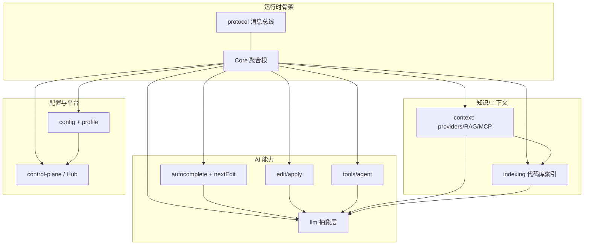

# `core/` 模块架构文档

> Continue 的「大脑」——与宿主无关的纯 TS 核心。顶层全局视角见上一级 [`../overview.md`](../overview.md)。

`core/` 是一个由 `Core` 聚合根（`core/core.ts`）统一编排的可插拔子系统集合，通过强类型三方消息协议与 IDE / GUI 通信。本目录按子系统分类细化各模块的架构设计。

## 模块地图

## 文档索引

| 文档                                                           | 模块                                                                                                             | 内容                                                                                     |
| -------------------------------------------------------------- | ---------------------------------------------------------------------------------------------------------------- | ---------------------------------------------------------------------------------------- |
| [runtime-and-protocol.md](runtime-and-protocol.md)             | `protocol/`、`core.ts`、`commands/`、`data/`                                                                     | 三方消息协议模型、`IMessenger`、`Core` 聚合根、Slash 命令、开发数据                      |
| [llm.md](llm.md)                                               | `llm/`                                                                                                           | `BaseLLM` 模板方法、63 个 provider 注册、streamChat 调用链、token/模板/适配器、扩展点    |
| [autocomplete-and-next-edit.md](autocomplete-and-next-edit.md) | `autocomplete/`、`nextEdit/`                                                                                     | 补全流水线、Next Edit 预测、缓存/防抖/过滤、两者对比                                     |
| [context.md](context.md)                                       | `context/`                                                                                                       | Provider 抽象与分类、RAG 多源检索、MCP 接入与 OAuth                                      |
| [edit-and-apply.md](edit-and-apply.md)                         | `edit/`                                                                                                          | inline edit / apply 两条路径、streamDiffLines 流水线、lazy apply                         |
| [indexing.md](indexing.md)                                     | `indexing/`                                                                                                      | `CodebaseIndex` 抽象、各索引对比、refresh 增量流程、跨分支去重                           |
| [config.md](config.md)                                         | `config/`                                                                                                        | 配置加载、Profile/Org 切换、多来源合并、两个 config 包关系                               |
| [tools-and-agent.md](tools-and-agent.md)                       | `tools/`                                                                                                         | Agent 工具调用端到端链路、内置/MCP/HTTP 工具、客户端工具                                 |
| [control-plane.md](control-plane.md)                           | `control-plane/`                                                                                                 | Continue Hub 连接、认证、MDM 许可、组织策略                                              |
| [utilities-and-misc.md](utilities-and-misc.md)                 | `util/`、`utils/`、`diff/`、`promptFiles/`、`codeRenderer/`、`continueServer/`、`deploy/`、`tag-qry/`、`vendor/` | 基础设施工具、diff 算法、.prompt 文件、代码渲染、托管服务客户端、vendored 依赖等         |
| [agent-conversation-flow.md](agent-conversation-flow.md)       | 跨模块                                                                                                           | **全链路时序图**：一次带工具调用的 Agent 对话（多轮 streamChat 循环 + 工具执行 + Apply） |

## 阅读顺序建议

1. 先读 [runtime-and-protocol.md](runtime-and-protocol.md) 理解 `Core` 与三方通信骨架
2. 想快速建立端到端直觉 → 读 [agent-conversation-flow.md](agent-conversation-flow.md) 的全链路时序图
3. 再按需求深入具体子系统：做模型相关 → `llm.md`；做补全 → `autocomplete-and-next-edit.md`；做 RAG/上下文 → `context.md` + `indexing.md`；做 Agent → `tools-and-agent.md`；查工具函数 / diff / .prompt → `utilities-and-misc.md`

## 维护约定

`core/` 相关模块发生架构级变更（新增子系统、协议消息方向变化、provider 注册机制变化、索引/检索流程调整等）时，应同步更新本目录对应文档，保持与代码一致。
