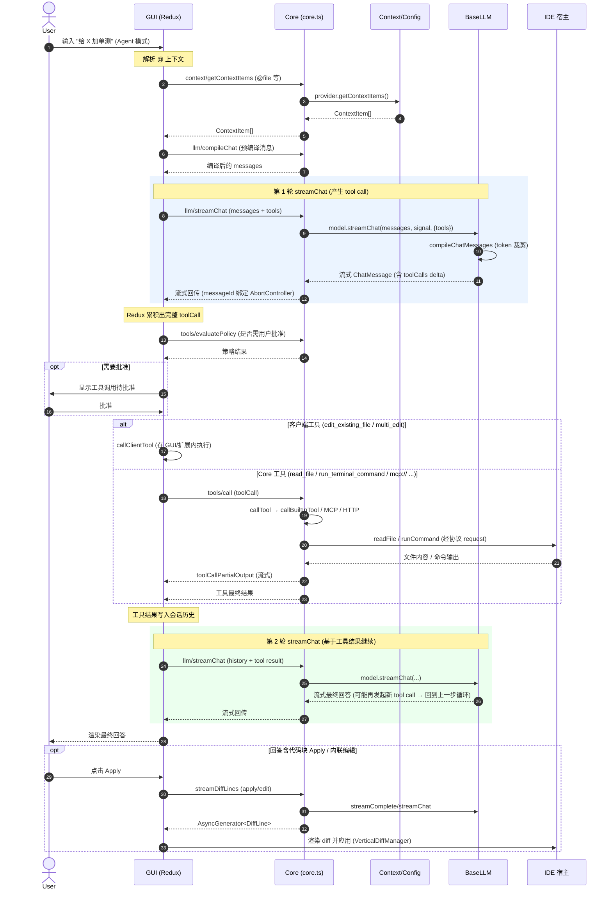

# 全链路时序：一次带工具调用的 Agent 对话

> 本文把 [runtime-and-protocol](runtime-and-protocol.md)、[llm](llm.md)、[tools-and-agent](tools-and-agent.md)、[context](context.md)、[edit-and-apply](edit-and-apply.md) 串成一条端到端链路，展示用户在 Agent 模式发一句话、模型调用一个工具、再产出最终回答的完整过程。

## 核心要点（先记住这条）

**`llm/streamChat` 只负责产生 tool call delta，不执行工具。** 工具的实际执行由 GUI 在一次流式结束后、根据策略发起（`tools/call` 到 Core，或客户端工具在 GUI 内执行），结果写回会话历史后再发起**下一轮** `llm/streamChat`。一次「带工具的对话」因此是**多轮 streamChat 的循环**。

## 角色

| 角色 | 实体                                                                     |
| ---- | ------------------------------------------------------------------------ |
| User | 在 GUI 输入框发消息                                                      |
| GUI  | `gui/`（React + Redux），含 `streamNormalInput`、`callToolById` 等 thunk |
| Core | `core/core.ts` 聚合根 + 各子系统                                         |
| LLM  | `BaseLLM` 子类（经 `llm/streamChat`）                                    |
| IDE  | 宿主（`VsCodeIde` / `MessageIde`），提供文件 / 终端等能力                |

## 时序图

## 分阶段说明

### 阶段 0：上下文采集与编译

- 用户输入若含 `@file`、`@codebase` 等，GUI 发 `context/getContextItems` → Core 调对应 Provider（codebase 走 RAG 检索，详见 [context.md](context.md)）。
- `llm/compileChat` 把 system message（含 Agent 默认系统提示 + 适用 rules）、历史、上下文、工具定义编译为 `messages`。

### 阶段 1：第一轮 streamChat（产生工具调用）

- GUI 发 `llm/streamChat`，Core 选 `config.selectedModelByRole.chat`，调 `BaseLLM.streamChat`（内部 `compileChatMessages` 做 token 裁剪，详见 [llm.md](llm.md)）。
- Core 用 `messageId` 绑定 `AbortController`，支持中途 `abort`。
- 模型流式返回 assistant 消息，其中可能含 `toolCalls` 增量；Core 原样透传给 GUI。
- 若模型不支持 native function calling，GUI 用 `interceptSystemToolCalls` 从 markdown 代码块解析出 tool call。

### 阶段 2：策略评估与工具执行

- GUI 在 Redux 累积出完整 toolCall 后，发 `tools/evaluatePolicy` 判断是否需用户批准。
- 执行分两类（详见 [tools-and-agent.md](tools-and-agent.md)）：
  - **客户端工具**（`CLIENT_TOOLS_IMPLS`：`edit_existing_file`、`single_find_and_replace`、`multi_edit`）：在 GUI / 扩展内直接执行，不经 `tools/call`。
  - **Core 工具**：发 `tools/call` → `Core.handleToolCall` → `callTool`（built-in / `mcp://` / HTTP）。需要文件 / 终端时经协议 `request` 回调 IDE；过程输出经 `toolCallPartialOutput` 流式推回 GUI。

### 阶段 3：循环——基于工具结果继续

- 工具结果写入会话历史后，GUI 发**新一轮** `llm/streamChat`（`streamResponseAfterToolCall`）。
- 模型可能再发起工具调用（回到阶段 2，形成多轮循环），也可能产出最终自然语言回答。

### 阶段 4：应用产物（可选）

- 若最终回答含代码块，用户点 Apply → `streamDiffLines`（apply 模式）→ 流式 `DiffLine` → IDE 的 `VerticalDiffManager` 渲染并应用（详见 [edit-and-apply.md](edit-and-apply.md)）。

## 跨模块依赖一览

| 阶段       | 主要参与模块                                                                  |
| ---------- | ----------------------------------------------------------------------------- |
| 上下文     | `context/`（providers + retrieval + mcp）、`config/`                          |
| streamChat | `llm/`、`core.ts`、`protocol/messenger`                                       |
| 工具执行   | `tools/`、`context/mcp`（MCP 工具）、`IDE` 接口                               |
| 应用       | `edit/`、`diff/`、IDE 层 `ApplyManager`/`VerticalDiffManager`                 |
| 横切       | `util/`（Telemetry、history、errors、AbortController）、`data/`（token 统计） |
