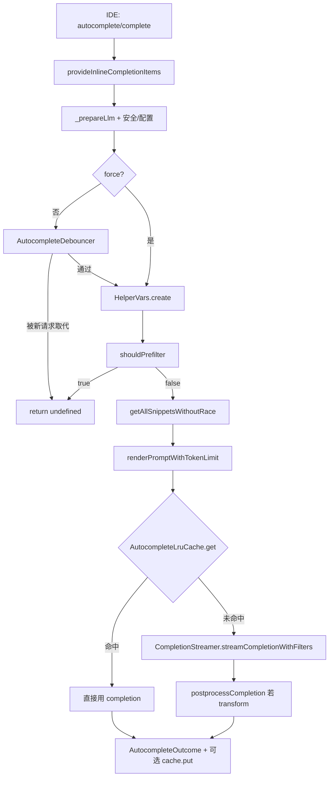
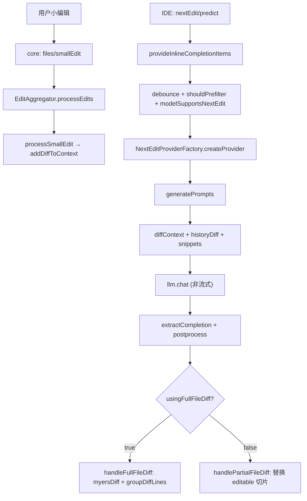

# 自动补全与 Next Edit

> 模块：`core/autocomplete/`、`core/nextEdit/`

## 1. 职责

| 模块                 | 职责                                                                                                                                                      |
| -------------------- | --------------------------------------------------------------------------------------------------------------------------------------------------------- |
| `core/autocomplete/` | 光标处的 **Fill-in-the-Middle（FIM）式行内补全**：采集上下文 → 拼 prompt → 流式调 LLM → 流式过滤 → 后处理 → LRU/SQLite 缓存                               |
| `core/nextEdit/`     | 用户编辑后预测**下一段可编辑区域的多行改写**（非单点补全）：聚合编辑 diff、拼 Chat 式 prompt → **非流式** `llm.chat` → Myers diff 分组 → 可选预取链式编辑 |

两者均由 `core/core.ts` 经 messenger 暴露：`autocomplete/complete` vs `nextEdit/predict`。

## 2. 自动补全端到端流水线

入口 `CompletionProvider.provideInlineCompletionItems`（`core/autocomplete/CompletionProvider.ts`）。

| 阶段        | 子目录 / 类                                                           | 说明                                                                                                              |
| ----------- | --------------------------------------------------------------------- | ----------------------------------------------------------------------------------------------------------------- |
| 触发        | `core.ts` `on("autocomplete/complete")`                               | 传入 `AutocompleteInput`                                                                                          |
| LLM / 配置  | `_prepareLlm`、`_getAutocompleteOptions`                              | 选模型、温度、legacy completions、实验开关                                                                        |
| 安全        | `indexing/ignore` `isSecurityConcern`                                 | 敏感路径直接返回                                                                                                  |
| 防抖        | `util/AutocompleteDebouncer`                                          | 非 `force` 时只保留最新请求                                                                                       |
| 上下文变量  | `util/HelperVars`                                                     | 读文件、`constructInitialPrefixSuffix`、token 裁剪、可选 AST                                                      |
| 预过滤      | `prefiltering/shouldPrefilter`                                        | disable、ignore、空 Untitled 等                                                                                   |
| 上下文采集  | `snippets/getAllSnippets*` + `context/ContextRetrievalService`        | 并行：root-path import、static（实验）、recently edited/opened/visited、clipboard；慢源 100ms 超时                |
| Prompt      | `templating/renderPromptWithTokenLimit`                               | Handlebars + `AutocompleteTemplate`（按模型）+ snippet 格式化 + stop tokens                                       |
| 缓存读      | `util/AutocompleteLruCache.get(prunedPrefix)`                         | 最长前缀匹配                                                                                                      |
| 生成        | `generation/CompletionStreamer`                                       | FIM 用 `streamFim`，否则 `streamComplete`；`GeneratorReuseManager` 复用进行中的流；`StreamTransformPipeline` 过滤 |
| 多行判定    | `classification/shouldCompleteMultiline`                              | 是否在首个 `\n` 截断                                                                                              |
| 后处理      | `postprocessing/postprocessCompletion`                                | 仅 `transform` 模式                                                                                               |
| 遥测 / 接受 | `util/AutocompleteLoggingService`、`filtering/BracketMatchingService` | 接受 / 拒绝遥测、括号配对                                                                                         |

### 关键机制

| 机制         | 位置                                                     | 行为                                                          |
| ------------ | -------------------------------------------------------- | ------------------------------------------------------------- |
| 防抖         | `AutocompleteDebouncer`                                  | 延时后仅最新请求 `shouldDebounce=false`，补全与 nextEdit 共用 |
| 上下文 race  | `getAllSnippets` 的 `racePromise(...,100)`               | 慢于 100ms 的来源放弃                                         |
| 流复用       | `GeneratorReuseManager`                                  | 新 prefix 是 `pending+completion` 前缀时不重新调 LLM          |
| 模型超时     | `stopAfterMaxProcessingTime` / `showWhateverWeHaveAtXMs` | 超时截断 / 先展示已有流                                       |
| 补全缓存     | `AutocompleteLruCache`                                   | SQLite + 内存 Map，容量 1000，键 `prunedPrefix`               |
| 打开文件缓存 | `openedFilesLruCache`                                    | QuickLRU 20 文件，随可见编辑器更新                            |
| 过滤         | `filtering/streamTransforms/`（char → line 流水线）      | stop token、suffix 边界、重复行、括号匹配                     |

## 3. Next Edit 流程

入口 `NextEditProvider`（**单例**，`core/nextEdit/NextEditProvider.ts`），按模型经 `NextEditProviderFactory` 选具体 provider（`MercuryCoderNextEditProvider`、`InstinctNextEditProvider`，共同基类 `BaseNextEditProvider`）。

- **编辑捕获**：`EditAggregator`（`context/aggregateEdits.ts`）按时间 / 行距把小编辑聚类成 cluster，cluster 完成后 `processSmallEdit` 生成 unified diff 并入上下文（最多保留 5 条）。
- **历史**：`DocumentHistoryTracker` 维护每文件内容 + AST 历史栈，提供 `historyDiff`；`prevEditLruCache` 记最近 5 次跨文件编辑。
- **预测**：`NextEditPromptEngine`（Handlebars）拼 `ModelSpecificContext`（snippets、diffContext、historyDiff、user excerpt）→ `llm.chat`（**非流式**）。
- **结果**：Full file diff 走 Myers diff 分组成 `DiffGroup`；Partial 直接替换可编辑区切片，附 `finalCursorPosition`。
- **链式 / 预取**：`provideInlineCompletionItemsWithChain` 用上一结果构造下一请求；`NextEditPrefetchQueue` 是实验性预取（代码注释表明实际更依赖模型一次返回多 diff，预取基本未启用）。

## 4. 补全 vs Next Edit 对比

| 维度   | autocomplete                           | nextEdit                                              |
| ------ | -------------------------------------- | ----------------------------------------------------- |
| API    | `streamFim` / `streamComplete`（流式） | `llm.chat`（非流式）                                  |
| 输出   | 光标处增量字符串                       | 可编辑区整段替换 + `diffLines` + 光标落点             |
| 上下文 | FIM prefix/suffix + snippets           | 编辑 diff 历史 + 文件 history diff + 同套 snippets    |
| 模型   | 通用 autocomplete 模型                 | `modelSupportsNextEdit`（Mercury-Coder、Instinct 等） |
| 结构   | 单一 `CompletionProvider`              | Factory + 模型子类，单例 Provider                     |

## 5. 设计模式

| 模式                | 体现                                                                                             |
| ------------------- | ------------------------------------------------------------------------------------------------ |
| Facade              | `CompletionProvider`、`ContextRetrievalService`                                                  |
| Singleton           | `NextEditProvider`、`EditAggregator`、`DocumentHistoryTracker`、`AutocompleteLruCache`           |
| Factory             | `NextEditProviderFactory.createProvider`                                                         |
| Strategy / 模板方法 | `AutocompleteTemplate` 按模型；`BaseNextEditProvider` 抽象 `generatePrompts`/`extractCompletion` |
| Pipeline / 责任链   | `StreamTransformPipeline` 串联 char→line 变换                                                    |
| Observer / Tee      | `ListenableGenerator` 多消费者读同一流，支撑流复用                                               |

## 6. 对外依赖

`IDE`（读文件 / 工作区 / 剪贴板 / 编辑事件）、`ILLM`（`streamFim`/`streamComplete`/`chat`）、`ConfigHandler`（`tabAutocompleteOptions`）、Tree-sitter（AST / import / 历史）、`core/llm/countTokens`（裁剪）、`indexing/ignore`（安全）、SQLite（缓存）、Handlebars（模板）、`diff` + `myersDiff`（diff）、Telemetry。
