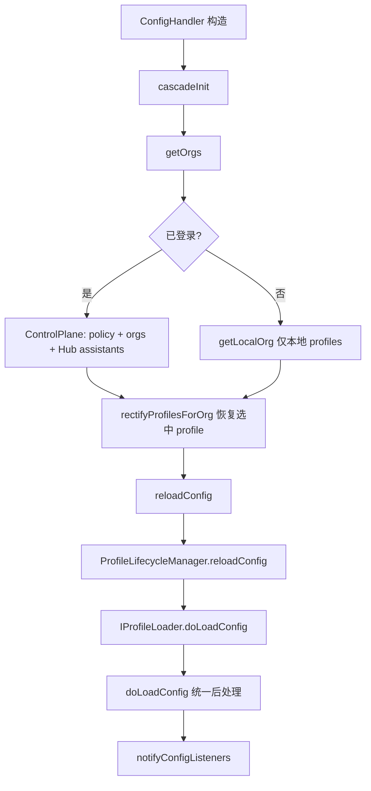

# 配置与 Profile（Config）

> 模块：`core/config/`
> 相关包：`packages/config-yaml`（新配置核心）、`packages/config-types`（遗留 JSON Zod 类型）

## 1. 职责

从**本地文件、Continue Hub、控制面策略**等多来源加载 assistant 配置，经 **unroll / merge** 转为运行时 `ContinueConfig`，并管理 **Org / Profile 选择与 reload 级联**。

## 2. 关键组件

| 文件                               | 职责                                              |
| ---------------------------------- | ------------------------------------------------- |
| `ConfigHandler.ts`                 | 配置总控：Org/Profile、级联 init/reload、监听器   |
| `ProfileLifecycleManager.ts`       | 单 Profile 配置缓存与 reload                      |
| `profile/IProfileLoader.ts`        | Profile 加载策略接口                              |
| `profile/LocalProfileLoader.ts`    | 本地 `config.yaml` / workspace agent 文件         |
| `profile/PlatformProfileLoader.ts` | Continue Hub 平台 assistant                       |
| `profile/doLoadConfig.ts`          | 统一加载管线：YAML/JSON → rules/MCP/tools/策略    |
| `yaml/loadYaml.ts`                 | YAML unroll、本地 block 注入、转 `ContinueConfig` |
| `loadLocalAssistants.ts`           | 扫描 `.continue/agents\|assistants\|configs`      |
| `markdown/loadCodebaseRules.ts`    | 工作区内联 `rules.md`（`CodebaseRulesCache`）     |
| `load.ts`                          | 遗留 `config.json` 加载路径                       |

## 3. 配置加载与 Profile 切换

### Profile 来源

| 来源            | Loader                                             | 类型                                     |
| --------------- | -------------------------------------------------- | ---------------------------------------- |
| 全局/主配置     | `LocalProfileLoader`（无 override）                | `local`（id=`local`，uri=`config.yaml`） |
| Workspace agent | `LocalProfileLoader`（带 `overrideAssistantFile`） | `local`                                  |
| Continue Hub    | `PlatformProfileLoader`                            | `platform`（id=`ownerSlug/packageSlug`） |

Org 结构：Personal（Hub + 本地 profiles）/ Team org（该 org Hub profiles + workspace 本地）。选中状态持久化在 `GlobalContext`（`lastSelectedOrgIdForWorkspace`、`lastSelectedProfileForWorkspace`）。

### 级联 reload 触发点

`refreshAll()`、`updateIdeSettings()`、`updateControlPlaneSessionInfo()`（登录/登出/换账号）、`setSelectedOrgId()`、`setSelectedProfileId()`、`registerCustomContextProvider()`。`reloadConfig` 会清除非当前 profile 缓存，加载当前 profile 后 `notifyConfigListeners`。

## 4. 多来源合并

**YAML 主配置展开（`loadConfigYaml`）**：

1. 收集本地 block：`.continue/{models,rules,context,...}` + global
2. Hub assistant：`unrollAssistant(packageIdentifier, RegistryClient, injectBlocks: localBlocks)`
3. Platform loader 已有 `overrideConfigYaml` 时：`mergeUnrolledAssistants(hubConfig, localUnrolled)`
4. 校验 `validateConfigYaml`

**`doLoadConfig` 叠加层**（在主配置之上 enrich）：

| 层            | 来源                                                                           | 合并方式                                        |
| ------------- | ------------------------------------------------------------------------------ | ----------------------------------------------- |
| Rules         | `.continuerules`、markdown rules、`CodebaseRulesCache`（colocated `rules.md`） | `rules.unshift(...)`                            |
| MCP           | YAML mcpServers + JSON MCP + 运行时连接                                        | 注入 tools、slashCommands、`MCPContextProvider` |
| 模型选择      | `GlobalContext.selectedModelsByProfileId`                                      | `rectifySelectedModelsFromGlobalContext`        |
| 组织策略      | `PolicySingleton`                                                              | 覆盖 telemetry、disableIndexing、MCP 等         |
| Shared config | `GlobalContext.getSharedConfig()`                                              | `modifyAnyConfigWithSharedConfig`               |

Legacy：无 `config.yaml` 时走 `loadContinueConfigFromJson`（`load.ts`）。Onboarding（`onboarding.ts`）为新用户预设 Ollama chat/autocomplete/embed 模型 slug。

## 5. 两个 config 包的关系

- `packages/config-yaml`：新配置体系**核心**——assistant/block unroll、Hub slug 解析、secrets、merge、markdown 规则解析；`core/config` 大量直接依赖
- `packages/config-types`：较旧的 **JSON 配置 Zod 类型**（`ConfigJson` 等），`core` 中主要用于 control-plane 客户端与 analytics，主路径已迁移到 config-yaml + 内部 `ContinueConfig`

## 6. 设计模式

| 模式          | 体现                                                         |
| ------------- | ------------------------------------------------------------ |
| 策略          | `IProfileLoader`（Local vs Platform）                        |
| 级联 / 责任链 | `cascadeInit` → `reloadConfig`；`doLoadConfig` 多阶段 enrich |
| Cache-aside   | `ProfileLifecycleManager.savedConfigResult`                  |
| 单例          | `CodebaseRulesCache`、`PolicySingleton`                      |
| Observer      | `ConfigHandler.onConfigUpdate` 通知索引等子系统              |

## 7. 对外依赖

`@continuedev/config-yaml`、`@continuedev/config-types`、`ControlPlaneClient`（登录态 / orgs / assistants / policy）、`core/llm`（实例化各 role 模型）、`core/context`（Provider / MCP）、`core/indexing/walkDir`（扫描 assistant 文件）、`GlobalContext`、`IDE`。
