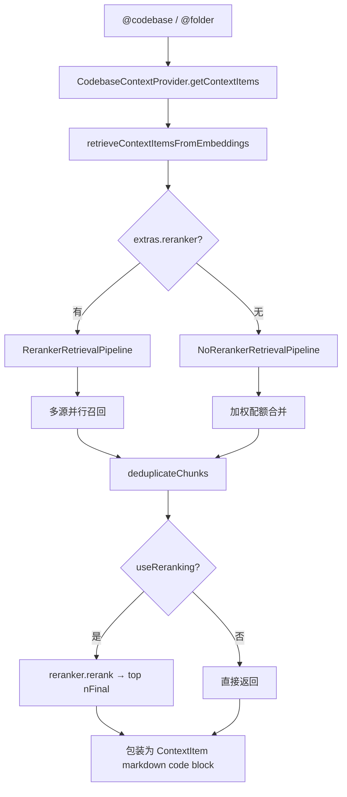

# 上下文系统：Providers / RAG 检索 / MCP

> 模块：`core/context/`（`providers/`、`retrieval/`、`mcp/`）

## 1. 职责

为 Chat / Agent 提供可插拔的**上下文注入层**：用户输入 `@provider` 时拉取 `ContextItem[]`，其中 codebase/docs 走 RAG 检索，MCP 资源走 MCP 协议。

## 2. Provider 抽象（`core/context/index.ts`）

```ts
export abstract class BaseContextProvider implements IContextProvider {
  abstract getContextItems(query, extras): Promise<ContextItem[]>;
  async loadSubmenuItems(args): Promise<ContextSubmenuItem[]> {
    return [];
  }
}
```

| 成员                             | 用途                                                                                 |
| -------------------------------- | ------------------------------------------------------------------------------------ |
| `description`                    | 静态描述：`title`（@ 名）、`type`（`normal`/`query`/`submenu`）、`dependsOnIndexing` |
| `getContextItems(query, extras)` | 核心：把用户选择/输入转为 `ContextItem[]`                                            |
| `loadSubmenuItems(args)`         | submenu 类型填充下拉（文件、commit、MCP 资源）                                       |

`ContextProviderExtras` 注入 `config`、`llm`、`ide`、`fullInput`、`embeddingsProvider`、`reranker`、`selectedCode`、`fetch`、`isInAgentMode`。

调用链：配置加载 `loadConfigContextProviders()` → 前端 `@` → `context/getContextItems` → `Core.getContextItems()`；submenu → `context/loadSubmenuItems`。非内置条目由 `CustomContextProviderClass` 适配为 `IContextProvider`。

## 3. 内置 Provider 分类（31 个 + 动态 MCP）

| 类别        | 代表 Provider                                                                                                                                                        | `@title`                                    | 用途                                                |
| ----------- | -------------------------------------------------------------------------------------------------------------------------------------------------------------------- | ------------------------------------------- | --------------------------------------------------- |
| 文件/目录   | `FileContextProvider` / `FolderContextProvider` / `CurrentFileContextProvider` / `OpenFilesContextProvider` / `ClipboardContextProvider`                             | `file` / `folder` / `currentFile` / `open`  | 文件内容、目录 RAG、当前/打开文件、剪贴板           |
| 代码库/RAG  | `CodebaseContextProvider` / `CodeContextProvider` / `SearchContextProvider` / `RepoMapContextProvider`                                                               | `codebase` / `code` / `search` / `repo-map` | 全库 RAG、片段索引、ripgrep 精确搜索、repo map 摘要 |
| IDE 状态    | `DiffContextProvider` / `TerminalContextProvider` / `ProblemsContextProvider` / `DebugLocalsProvider` / `RulesContextProvider`                                       | — / `rules`                                 | Git diff、终端、LSP 诊断、调试变量、Rules           |
| Git/PR      | `GitCommitContextProvider` / `GitHubIssuesContextProvider` / `GitLabMergeRequestContextProvider`                                                                     | `commit`                                    | commit / Issue / MR                                 |
| 外部系统/DB | `JiraIssuesContextProvider` / `PostgresContextProvider` / `DatabaseContextProvider` / `DiscordContextProvider` / `GoogleContextProvider` / `GreptileContextProvider` | `postgres` / `database` / `greptile`        | Jira、DB schema、外部服务                           |
| Docs/网络   | `DocsContextProvider` / `URLContextProvider` / `WebContextProvider`                                                                                                  | `docs` / `url` / `web`                      | 文档站向量检索、抓 URL、网络搜索                    |
| HTTP/代理   | `HttpContextProvider` / `ContinueProxyContextProvider`                                                                                                               | `continue-proxy`                            | 自定义 HTTP 服务、Continue Teams                    |
| MCP         | `MCPContextProvider`                                                                                                                                                 | `mcp-{id}`                                  | 每个 MCP 服务器动态注册，读 resource                |
| 系统        | `OSContextProvider`                                                                                                                                                  | `os`                                        | OS/CPU 信息                                         |

默认始终加载（可被配置覆盖）：`file`、`currentFile`、`diff`、`terminal`、`problems`、`rules`。

## 4. RAG 检索端到端（`core/context/retrieval/`）

入口 `retrieveContextItemsFromEmbeddings()`（`retrieval.ts`）。



多源召回（`BaseRetrievalPipeline` 及子类）：

| 来源             | 方法                                    | 底层                                                 |
| ---------------- | --------------------------------------- | ---------------------------------------------------- |
| 全文检索         | `retrieveFts()`                         | `FullTextSearchCodebaseIndex`（SQLite FTS5 trigram） |
| 向量检索         | `retrieveEmbeddings()`                  | `LanceDbIndex.retrieve()`（embed → 近邻）            |
| 最近编辑         | `retrieveAndChunkRecentlyEditedFiles()` | `openedFilesLruCache` + `chunkDocument()`            |
| Repo Map         | `requestFilesFromRepoMap()`             | LLM 读 repo map 选 5–10 文件后读全文                 |
| 工具调用（实验） | `retrieveWithTools()`                   | LLM 选 built-in tools（grep/ls/readFile）            |

- **无 Reranker** 配额：recentlyEdited 25% + FTS 25% + embeddings 50%
- **有 Reranker**：各源各取 `nRetrieve` → 去重 → `rerank` 打分 → 取 `nFinal`
- **Docs 独立路径**：`DocsContextProvider` 用 `DocsService` 自有索引 + rerank，不走上述 pipeline

## 5. MCP 接入（`core/context/mcp/`）

```
config YAML/JSON → loadJsonMcpConfigs() → MCPManagerSingleton.setConnections()
    → 各 MCPConnection.connectClient()
```

- `MCPManagerSingleton`（单例）：`Map<serverId, MCPConnection>`，支持 `setEnabled`、`refreshConnections`、`shutdown`
- `MCPConnection.connectClient()` 支持传输：`stdio`、`sse`、`streamable-http`、`websocket`（URL 无 type 时 HTTP 失败 fallback SSE）；连接成功后枚举 resources / resourceTemplates / tools / prompts

能力暴露到 Continue（`doLoadConfig.ts`）：

| MCP 能力           | Continue 映射                                      |
| ------------------ | -------------------------------------------------- |
| Tools              | `config.tools[]`（`getMCPToolName`）               |
| Prompts            | `config.slashCommands[]`（`source: "mcp-prompt"`） |
| Resources          | 动态 `MCPContextProvider`（每 server 一个）        |
| Resource Templates | submenu + `{query}` 模板替换                       |

OAuth（`MCPOauth.ts`）：SSE transport 在连接前 `getOauthToken()`；`MCPConnectionOauthProvider` 实现 MCP SDK 的 `OAuthClientProvider`，token 存 `GlobalContext.mcpOauthStorage`；流程经本地回调 → `handleMCPOauthCode()` → 刷新连接。运行时 IPC：`mcp/reloadServer`、`mcp/getPrompt`、`mcp/startAuthentication` 等。

## 6. 设计模式

| 模式          | 体现                                                         |
| ------------- | ------------------------------------------------------------ |
| 模板方法      | `BaseContextProvider`、`BaseRetrievalPipeline.run()`         |
| 策略          | `RerankerRetrievalPipeline` vs `NoRerankerRetrievalPipeline` |
| 单例          | `MCPManagerSingleton`、`DocsService`                         |
| 注册表 / 工厂 | `Providers[]` + `contextProviderClassFromName()`             |
| 适配器        | `CustomContextProviderClass`                                 |
| 管道          | RAG 多源召回 → 去重 → rerank → 格式化                        |

## 7. 对外依赖

`core/indexing/`（`FullTextSearchCodebaseIndex`、`LanceDbIndex`、`chunkDocument`、`DocsService`）、`core/util/generateRepoMap`、`core/tools/`（工具召回）、`@modelcontextprotocol/sdk`（MCP）、各 Provider 第三方库（`pg`、`jsdom`+`@mozilla/readability`、Jira API 等）。
