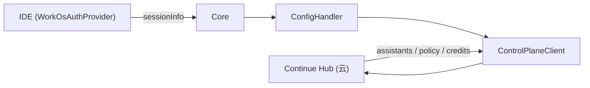

# 控制面（Control Plane）与 Continue Hub

> 模块：`core/control-plane/`

## 1. 职责

连接 Continue Hub（云控制面），负责**认证、环境选择、API 客户端、MDM 企业许可、组织策略**等。Hub 是配置 / 身份 / 计费 / 远程能力的来源，但**不替代本地 IDE 执行环境**。

| 文件                 | 职责                                                             |
| -------------------- | ---------------------------------------------------------------- |
| `env.ts`             | 选择 `ControlPlaneEnv`（Hub / Staging / Local / Test / On-Prem） |
| `auth/index.ts`      | 生成 WorkOS 登录 URL                                             |
| `client.ts`          | `ControlPlaneClient`：Hub REST API                               |
| `AuthTypes.ts`       | `ControlPlaneSessionInfo`、`HubEnv` 等类型                       |
| `mdm/mdm.ts`         | 企业许可证校验与 API URL 覆盖                                    |
| `PolicySingleton.ts` | 组织策略缓存                                                     |

## 2. 环境与认证

- **`env.ts`**：根据 `.continue` 环境文件、`IdeSettings.continueTestEnvironment`、MDM 许可证中的 `apiUrl` 选择环境。生产 Hub 为 `https://api.continue.dev/` + `https://continue.dev/`。
- **`auth/index.ts`**：Hub 环境下生成 WorkOS `authorize` URL，回调到 `APP_URL/tokens/...`。会话信息由扩展提供（VS Code 的 `WorkOsAuthProvider`），经 `getControlPlaneSessionInfo` 传入。

## 3. `ControlPlaneClient`

在 `ConfigHandler` 构造时创建，用 Bearer token 访问 Hub API：

- 助手 / 组织列表
- `ide/sync-secrets`
- 远程会话
- `getCreditStatus`（计费）
- 组织策略

## 4. 与 Core 的消息

`controlPlane/getEnvironment`、`controlPlane/getCreditStatus`、`controlPlane/openUrl`、`auth/getAuthUrl`、`didChangeControlPlaneSessionInfo`、`mdm/setLicenseKey`。

## 5. MDM 与策略

- **`mdm/mdm.ts`**：校验 base64 许可证（`validateLicenseKey`、`getLicenseKeyData`），可把 API 端点覆盖为 On-Prem；`Core` 处理 `mdm/setLicenseKey` → `setMdmLicenseKey`。
- **`PolicySingleton`**：缓存组织 `Policy`，供配置加载（覆盖 telemetry / disableIndexing / MCP 等）与工具策略使用。

## 6. 在整体中的位置

配置加载（见《配置与 Profile》）在登录态下会从 Hub 拉 assistants 与 policy；`PolicySingleton` 的策略再回灌到 `doLoadConfig` 的合并层。
