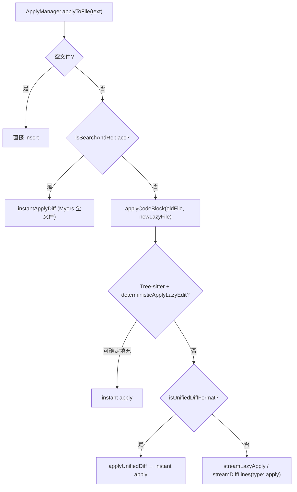

# 编辑与应用（Edit / Apply）

> 模块：`core/edit/`，相关：`core/diff/`

## 1. 职责

负责**代码编辑与 Apply**：调用 LLM 流式生成新代码，与旧代码做行级 diff（`DiffLine`），经 IDE 层逐行渲染 / 应用。含 inline edit、lazy apply、search-and-replace、统一 diff 解析等路径。

## 2. 两条主路径

| 路径                                  | 触发                 | 入口                                                                 |
| ------------------------------------- | -------------------- | -------------------------------------------------------------------- |
| **Inline Edit**（选中代码编辑）       | 用户在编辑器选区触发 | `VerticalDiffManager.streamEdit()` → `streamDiffLines(type: "edit")` |
| **Apply**（把 Chat 代码块应用到文件） | 点击代码块 Apply     | `ApplyManager.applyToFile()` → `applyCodeBlock()`                    |

## 3. `streamDiffLines()` 核心流水线（`core/edit/streamDiffLines.ts`）

1. **Prompt 构建**：`edit` → `constructEditPrompt()`（`gptEditPrompt` 模板）；`apply` → `constructApplyPrompt(original, newCode)`
2. **Rules 注入**：`getSystemMessageWithRules()` 把适用的 rules 加入 system message
3. **LLM 流**：`recursiveStream()` → `llm.streamComplete` / `streamChat`
4. **行级过滤**：`filterEnglishLinesAtStart`、`filterCodeBlockLines`、`stopAtLines`、`skipLines`、`removeTrailingWhitespace`
5. **Diff**：`streamDiff(oldLines, newLinesStream)`（`core/diff/streamDiff.ts`）产出 `{ type: "same"|"new"|"old", line }`
6. **缩进修复**：插入场景 `addIndentation()`

## 4. Lazy Apply（`core/edit/lazy/`）

适用于模型只输出「改动片段 + `UNCHANGED_CODE` 占位符」的场景：

- `applyCodeBlock.ts`：路由 instant vs lazy
- `deterministic.ts`：Tree-sitter 确定性填充（`deterministicApplyLazyEdit`、`isLazyText`），命中即 instant apply
- `unifiedDiffApply.ts`：识别并应用统一 diff 格式
- `streamLazyApply.ts`：模型 lazy prompt → `streamFillUnchangedCode` + `getReplacementWithLlm` 从原文件补全未改部分 → `streamDiff` 生成 `DiffLine` 流

## 5. 回传与取消

- **协议**：`streamDiffLines` 在 `passThrough.ts` 中透传，返回 `AsyncGenerator<DiffLine>`
- **Core 处理**：`core/core.ts` 选 model（edit/apply/chat role），`ApplyAbortManager.get(fileUri)` 提供 `AbortController`
- **取消**：`cancelApply` → `ApplyAbortManager.clear()` 中止所有流
- **IDE 渲染**：`VerticalDiffManager`（VS Code 侧）消费 generator，把 `DiffLine` 写入编辑器装饰并增量应用

## 6. 设计模式

| 模式                        | 体现                                                          |
| --------------------------- | ------------------------------------------------------------- |
| Async Generator / Streaming | `streamDiffLines`、`streamLazyApply`、`streamDiff` 全链路流式 |
| 单例                        | `ApplyAbortManager`                                           |
| 策略                        | `applyCodeBlock` 在 deterministic / unifiedDiff / lazy 间路由 |

## 7. 对外依赖

`core/llm/`（`streamComplete`/`streamChat` + `gptEditPrompt`/`defaultApplyPrompt` 模板）、`core/diff/`（`streamDiff`、`myersDiff`）、`core/autocomplete/filtering/streamTransforms/`（行流过滤）、`core/llm/rules/getSystemMessageWithRules`、`web-tree-sitter`（deterministic lazy apply）、IDE 层 `ApplyManager` / `VerticalDiffManager`（消费 diff 流）。
