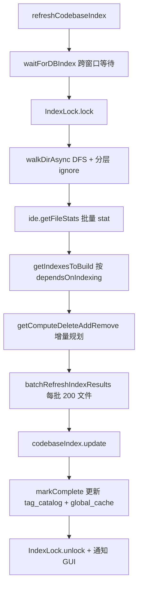

# 代码库索引（Indexing）

> 模块：`core/indexing/`

## 1. 职责

对代码库做**可增量、多 artifact、跨分支去重**的索引编排：发现文件 → 忽略过滤 → 分块 / 嵌入 → 写入 SQLite / LanceDB 等后端，供 `@codebase` 等 Context Provider 检索。

## 2. 核心抽象：`CodebaseIndex`（`core/indexing/types.ts`）

```ts
export interface CodebaseIndex {
  artifactId: string;
  relativeExpectedTime: number;
  update(
    tag: IndexTag,
    results: RefreshIndexResults,
    markComplete: MarkCompleteCallback,
    repoName: string | undefined,
  ): AsyncGenerator<IndexingProgressUpdate>;
}
```

- `IndexTag`：`{ directory, branch, artifactId }`
- `RefreshIndexResults`：`compute | del | addTag | removeTag` 四类文件操作
- 索引类型由 Context Provider 声明 `dependsOnIndexing` 驱动（`chunk | embeddings | fullTextSearch | codeSnippets`）

### 各索引实现对比

| 类型键           | 实现类                        | 存储                                            | 用途                             | 相对耗时 |
| ---------------- | ----------------------------- | ----------------------------------------------- | -------------------------------- | -------- |
| `chunk`          | `ChunkCodebaseIndex`          | SQLite `chunks` + `chunk_tags`                  | 结构分块，供 FTS / 检索复用      | 1        |
| `embeddings`     | `LanceDbIndex`                | LanceDB（按 tag 分表）+ SQLite `lance_db_cache` | 语义向量检索                     | 13       |
| `fullTextSearch` | `FullTextSearchCodebaseIndex` | SQLite FTS5 + `fts_metadata`                    | 关键词检索（**读 `chunks` 表**） | 0.2      |
| `codeSnippets`   | `CodeSnippetsCodebaseIndex`   | SQLite `code_snippets` + tag 表                 | tree-sitter 顶层符号             | 1        |
| （内部）         | `GlobalCacheCodeBaseIndex`    | SQLite `global_cache`                           | 同内容 hash 跨分支复用           | 1        |

> 依赖：FTS 从 `chunks` 表读分块再写，所以 `chunk` 索引须先于 / 与 FTS 同步；`LanceDbIndex` 自行分块嵌入，不依赖 `chunks` 表。

## 3. 一次 refresh 端到端流程

入口 `CodebaseIndexer.refreshCodebaseIndex(paths)`（`core/indexing/CodebaseIndexer.ts`）。



### 文件发现与忽略

`walkDirAsync`（`walkDir.ts`）DFS 遍历，每层叠加 ignore：

- 默认：`defaultIgnoreFileAndDir`（`ignore.ts`，含安全 + 二进制 / 依赖目录）
- 全局：`~/.continueignore`（`continueignore.ts`）
- 目录级：`.gitignore`、`.continueignore`（后者可覆盖）

`shouldIgnore`（`shouldIgnore.ts`）：单文件场景自底向上复查 + 跳过符号链接。

### 增量规划（`refreshIndex.ts`）

1. 过滤 >5MB 文件（`MAX_FILE_SIZE_BYTES`）
2. 对比 SQLite `tag_catalog`（按 `dir + branch + artifactId`）与当前文件状态
3. 内容 hash 用 **SHA-256** 作 `cacheKey`
4. 查 `global_cache`：新文件但 hash 已存在 → **`addTag`**（不重复计算）；删除但多分支共享 → **`removeTag`**；否则 `compute`/`del`

### 分块 → 嵌入 → 写入

| 索引               | compute 路径                                                                                                                       |
| ------------------ | ---------------------------------------------------------------------------------------------------------------------------------- |
| ChunkCodebaseIndex | `chunkDocument`（tree-sitter 结构分块 `code.ts` 或回退 `basic.ts`）→ `chunks` + `chunk_tags`，可选 Continue Server 远程 chunk 缓存 |
| FullTextSearch     | 从 `chunks` 读 content → 插入 FTS5                                                                                                 |
| LanceDbIndex       | `chunkDocument` → `embeddingsProvider.embed()` → LanceDB + `lance_db_cache`                                                        |
| CodeSnippets       | tree-sitter query → `code_snippets`                                                                                                |

批处理 `filesPerBatch = 200`，控制内存与 embed API 调用次数。

### Embeddings 与 LLM 层的关系

- `config.selectedModelByRole.embed` 是一个 **`ILLM` 实例**
- `LanceDbIndex.create(embeddingsModel, ...)` 持有它；`getEmbeddings()` → `embeddingsProvider.embed(...)`
- `BaseLLM.embed`（`core/llm/index.ts`）按 `maxEmbeddingBatchSize` 分批，支持 OpenAI adapter 或子类 `_embed`

## 4. DocsService（平行子系统）

`core/indexing/docs/DocsService.ts` **不属于 `CodebaseIndex` 体系**，是 indexing 目录下的平行子系统：监听配置更新，按 `config.docs` 爬取文档站 → 分块 → `embed()` → LanceDB `docs` 表 + SQLite 元数据，供 `DocsContextProvider` 检索。`embedModelsAreEqual` 被 `CodebaseIndexer` 复用以判断是否需 reindex。

## 5. 设计模式

| 模式                         | 体现                                                            |
| ---------------------------- | --------------------------------------------------------------- |
| 策略                         | `CodebaseIndex` 多实现                                          |
| Orchestrator / Facade        | `CodebaseIndexer` 协调 walk / diff / 批处理 / 各 index          |
| 工厂                         | `LanceDbIndex.create()`（平台检测 + 动态 import vectordb）      |
| Content-addressing + Tagging | SHA-256 `cacheKey` + `global_cache` 跨分支 dedup                |
| Lock / Mutex                 | `IndexLock` 防多窗口并发写 SQLite                               |
| Observer                     | 监听 `ConfigHandler.onConfigUpdate`，embed 模型变化触发 reindex |

## 6. 对外依赖

`IDE`（列目录 / 读文件 / branch / repo）、`ConfigHandler`（embed 模型、`disableIndexing`）、`ILLM`（`embed`）、`sqlite3`、`vectordb`（LanceDB）、`ignore`、`web-tree-sitter`、`ContinueServerClient`（可选远程 chunk 缓存）、`IMessenger`（进度上报）。
