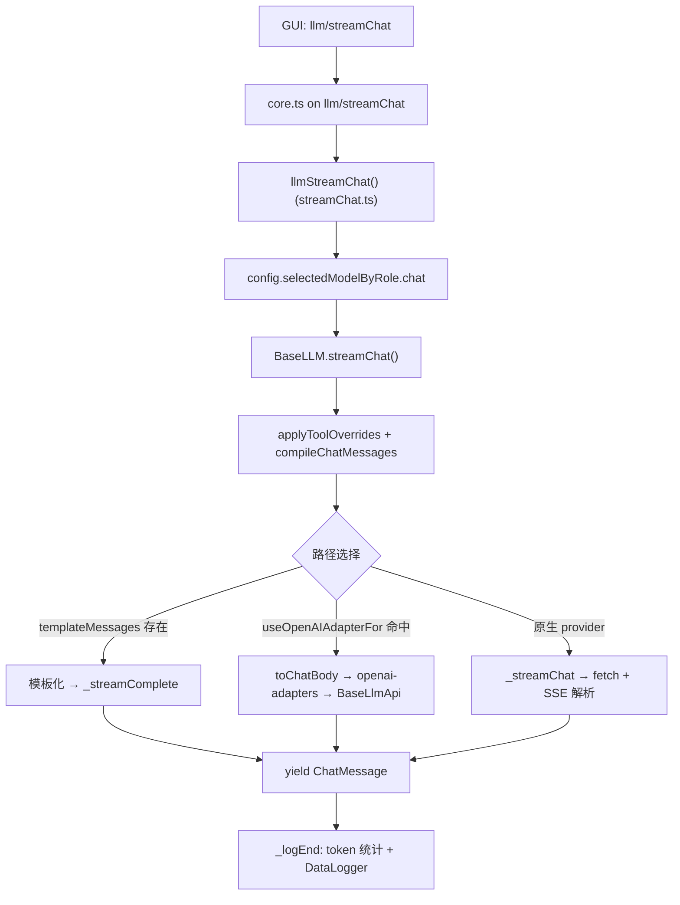

# LLM 抽象层

> 模块：`core/llm/`
> 相关包：`packages/openai-adapters`（HTTP 适配）、`packages/llm-info`（模型元数据）、`@continuedev/fetch`

## 1. 职责

Continue 核心的 **LLM 统一抽象层**：把配置中的模型描述实例化为具体 Provider，统一提供 chat / complete / FIM / embed / rerank 能力，并负责 prompt 模板化、上下文裁剪、token 计数、工具能力判定、交互日志与 HTTP 请求封装。

`core/llm/llms/` 下约 79 个文件，`LLMClasses` 注册表正式注册 **63 个 provider 类**。

## 2. 核心抽象：`BaseLLM`（`core/llm/index.ts`）

`BaseLLM` 是所有 provider 的抽象基类，采用**模板方法**：公开方法定义算法骨架（含日志、裁剪、统计），子类只实现 `_` 前缀的 Hook。

| 公开方法（骨架）                  | 子类 Hook                           | 说明                                                                                               |
| --------------------------------- | ----------------------------------- | -------------------------------------------------------------------------------------------------- |
| `streamChat()`                    | `_streamChat()`                     | 主路径：tool override → `compileChatMessages` → 选 adapter / 原生 / completion → 日志与 token 统计 |
| `chat()`                          | —                                   | 对 `streamChat` 的同步聚合                                                                         |
| `streamComplete()` / `complete()` | `_streamComplete()` / `_complete()` | 文本补全，先 `pruneRawPromptFromTop`                                                               |
| `streamFim()`                     | `_streamFim()`                      | Fill-in-the-Middle                                                                                 |
| `embed()`                         | `_embed()`                          | 向量嵌入，按 `maxEmbeddingBatchSize` 分批                                                          |
| `rerank()`                        | —                                   | 重排                                                                                               |
| `fetch()`                         | —                                   | 统一 HTTP：`fetchwithRequestOptions` + 指数退避 + 友好错误映射                                     |
| `compileChatMessages()`           | —                                   | 上下文裁剪（保留 system + tools + 末尾 tool 序列，从头部 prune 历史）                              |

子类还可覆写 `modifyChatBody(body)`、`createOpenAiAdapter()`、`useOpenAIAdapterFor` 等扩展点。

## 3. Provider 注册与工厂（`core/llm/llms/index.ts`）

- `LLMClasses: (typeof BaseLLM)[]` —— 手动 import 并追加的 provider 注册表（**无动态插件加载**）
- `llmFromDescription(desc, ...)` —— `LLMClasses.find(c => c.providerName === desc.provider)` 分发
- `llmFromProviderAndOptions(providerName, llmOptions)`

代表性 provider：

| Provider              | HTTP 路径                                                        |
| --------------------- | ---------------------------------------------------------------- |
| `OpenAI` / `Azure`    | OpenAI 兼容；`useOpenAIAdapterFor` 控制走 adapter 还是原生 fetch |
| `Anthropic`           | 原生 Messages API + SSE 解析                                     |
| `Ollama`              | 原生 `/api/chat`；若 `templateMessages` 非空走 completion        |
| `CustomLLM`           | 用户注入 `streamChat`/`streamCompletion`                         |
| `stubs/ContinueProxy` | 继承 OpenAI，经 Continue 云代理转发                              |

## 4. 一次 `streamChat` 的端到端调用链

三条路径都最终经 `BaseLLM.fetch()` → `fetchwithRequestOptions`（`@continuedev/fetch`）+ 指数退避。

## 5. 子系统

| 子系统         | 文件                                                                          | 职责                                                                                                             |
| -------------- | ----------------------------------------------------------------------------- | ---------------------------------------------------------------------------------------------------------------- |
| Token & 上下文 | `countTokens.ts`、`getAdjustedTokenCount.ts`、`asyncEncoder.ts` + worker pool | 计数、裁剪；GPT 用 js-tiktoken，其余用 Llama tokenizer；对 Claude(×1.23)/Gemini(×1.18)/Mistral(×1.26) 加安全缓冲 |
| 模型探测       | `autodetect.ts`、`fetchModels.ts`                                             | 探测模板类型、图像 / 推理 / 并行 / nextEdit 能力；拉取 UI 模型列表                                               |
| 模板           | `templates/chat.ts`、`templates/edit/*`、`defaultSystemMessages.ts`           | 开源模型的 chat / edit prompt 格式、默认 system message                                                          |
| 协议转换       | `openaiTypeConverters.ts`                                                     | Continue `ChatMessage` ↔ OpenAI API 双向转换（`toChatBody`、`fromChatCompletionChunk`）                         |
| 能力判定       | `toolSupport.ts`                                                              | `PROVIDER_TOOL_SUPPORT`、`modelSupportsNativeTools()`                                                            |
| 规则注入       | `rules/getSystemMessageWithRules.ts`                                          | 按 glob/regex/alwaysApply 合并 rules 到 system message（由调用方如 edit 流程触发，非 `streamChat` 内部自动）     |
| 日志           | `logger.ts`、`logFormatter.ts`                                                | `LLMLogger` 交互日志 + 人类可读流式格式化                                                                        |

## 6. 与 packages 的分工

| Package                        | 角色                                                                                                                                 |
| ------------------------------ | ------------------------------------------------------------------------------------------------------------------------------------ |
| `@continuedev/openai-adapters` | Provider 无关的 **OpenAI-shaped HTTP 客户端** `BaseLlmApi`，`constructLlmApi()` 构造；`openAICompatible()` 快速包装 Groq/Together 等 |
| `@continuedev/llm-info`        | **静态模型元数据** catalog，`findLlmInfo()` 提供 `contextLength`、`maxCompletionTokens`，不发 HTTP                                   |
| `@continuedev/fetch`           | `fetchwithRequestOptions`、`streamSse`、`streamResponse`                                                                             |

边界：`core/llm/llms/*` 处理 Continue 领域模型（thinking、tool overrides、模板、错误映射）；`openai-adapters` 处理 HTTP；`llm-info` 是与 runtime 解耦的模型 catalog。

## 7. 设计模式

| 模式     | 体现                                                                                   |
| -------- | -------------------------------------------------------------------------------------- |
| 模板方法 | `BaseLLM.streamChat` 等定义骨架，调 protected `_streamChat`/`_streamComplete`/`_embed` |
| 策略     | 每个 `llms/*.ts` 是一种 HTTP/协议策略；`useOpenAIAdapterFor` 在 adapter vs 原生间切换  |
| 适配器   | `BaseLlmApi`、`openaiTypeConverters`                                                   |
| 工厂     | `llmFromDescription`、`constructLlmApi`                                                |
| 注册表   | `LLMClasses` + `providerName` 静态字段匹配                                             |
| 继承     | `Azure extends OpenAI`、`ContinueProxy extends OpenAI`                                 |

## 8. 扩展点：新增一个 LLM provider

1. 在 `core/llm/llms/MyProvider.ts` 写 `class MyProvider extends BaseLLM`，设 `static providerName`（须与配置 `provider` 字段一致），按需选路径：
   - OpenAI 兼容 → 设 `useOpenAIAdapterFor = ["streamChat", ...]`
   - 原生 API → 实现 `_streamChat`
   - 仅 completion → 实现 `_streamComplete`，依赖 `autodetect` 设 `templateMessages`
2. import 并加入 `core/llm/llms/index.ts` 的 `LLMClasses`
3. OpenAI 兼容还需在 `packages/openai-adapters/src/index.ts` 的 `constructLlmApi()` switch 加 case
4. 推荐补元数据：`toolSupport.ts`（工具支持）、`autodetect.ts`（templating/图像）、`packages/llm-info`（已知模型 contextLength）

## 9. 被依赖关系

`core/core.ts`（`llmStreamChat`/`countTokens`/`fetchModels`）、`core/config/load.ts`（实例化各 role 模型）、`core/edit/streamDiffLines.ts`（edit 模板 + rules）、`core/autocomplete`、`core/indexing`（`embed`）等都依赖本模块。`core/llm` 自身不依赖 GUI，仅通过 `ILLM` 接口与协议对外暴露。
