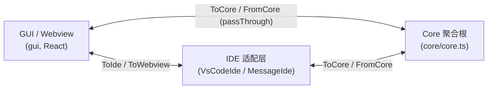

# Core 运行时骨架：消息协议与聚合根

> 模块：`core/protocol/`、`core/core.ts`、`core/data/`、`core/commands/`
> 这是理解整个 `core` 的地基——所有子系统都挂在 `Core` 聚合根上，并通过强类型消息协议与 IDE / GUI 通信。

## 1. 职责

| 模块             | 职责                                                                                                                     |
| ---------------- | ------------------------------------------------------------------------------------------------------------------------ |
| `core/protocol/` | 用 TypeScript 类型定义 IDE / GUI(Webview) / Core **三方消息契约**与方向组合，并提供 `IMessenger` 抽象与进程内 / IPC 实现 |
| `core/core.ts`   | **聚合根**：构造全部子系统、注册约 100 个 `ToCoreProtocol` handler，协调配置 / 索引 / 补全 / 聊天 / 工具 / 控制面        |
| `core/commands/` | Slash 命令的转换与 MCP Prompt 序列化（执行入口实际在 `llm/streamChat`）                                                  |
| `core/data/`     | 开发期遥测：`devdata/log` 落盘 / 上报 + 本地 SQLite token 统计                                                           |

## 2. 三方消息协议模型

系统最核心的解耦设计：**Core 与宿主无关**，IDE / GUI / Core 三个角色只通过类型化消息互相通信。



### 2.1 协议类型组合（`core/protocol/index.ts`）

```ts
// IDE
export type ToIdeProtocol = ToIdeFromWebviewProtocol & ToIdeFromCoreProtocol;
// Webview
export type ToWebviewProtocol = ToWebviewFromIdeProtocol &
  ToWebviewFromCoreProtocol &
  ToWebviewOrCoreFromIdeProtocol;
// Core
export type ToCoreProtocol = ToCoreFromIdeProtocol &
  ToCoreFromWebviewProtocol &
  ToWebviewOrCoreFromIdeProtocol;
export type FromCoreProtocol = ToWebviewFromCoreProtocol &
  ToIdeFromCoreProtocol;
```

每个协议条目形如 `messageName: [请求类型, 响应类型]`（`IProtocol = Record<string, [any, any]>`）。

| 协议文件                  | 定义内容                                                                                                              |
| ------------------------- | --------------------------------------------------------------------------------------------------------------------- |
| `protocol/core.ts`        | Core 侧「入站」消息全集（IDE + Webview 共享 + 文件事件），如 `llm/streamChat`、`tools/call`、`context/*`              |
| `protocol/ide.ts`         | IDE 能力对应的 RPC（基本镜像 `IDE` 接口）；`ToWebviewOrCoreFromIdeProtocol` 含 IDE 推事件 `didChangeActiveTextEditor` |
| `protocol/ideCore.ts`     | `ToIdeFromCoreProtocol`、`ToCoreFromIdeProtocol` 别名                                                                 |
| `protocol/coreWebview.ts` | Webview 专有入站（`didChangeSelectedProfile`/`didChangeSelectedOrg`）                                                 |
| `protocol/ideWebview.ts`  | Webview↔IDE 专有（`applyToFile`、`acceptDiff`、背景 Agent 等）                                                       |
| `protocol/webview.ts`     | Core/IDE 推送给 GUI 的事件（`configUpdate`、`indexProgress`、`toolCallPartialOutput`）                                |
| `protocol/passThrough.ts` | GUI↔Core 不经扩展逻辑直接转发的消息白名单                                                                            |

### 2.2 `IMessenger` 语义（`core/protocol/messenger/index.ts`）

| 方法                  | 语义                                                               |
| --------------------- | ------------------------------------------------------------------ |
| `on(type, handler)`   | 注册**入站** handler（Core 在 `registerMessageHandlers` 大量使用） |
| `invoke(type, data)`  | **同步**调用本侧 handler（同进程直接调函数）                       |
| `send(type, data)`    | **单向**推送到对侧 listener（如 `configUpdate` 推 GUI）            |
| `request(type, data)` | **异步 RPC** 到对侧（如 `readFile` 让 IDE 读盘）                   |

`InProcessMessenger` 额外提供 `externalOn` / `externalRequest`，供扩展侧注册「Core 发来的消息」处理器。

### 2.3 运行时拓扑（两种部署形态）

| 宿主                  | 部署                  | IDE 实现                                      | Messenger                                     |
| --------------------- | --------------------- | --------------------------------------------- | --------------------------------------------- |
| **VS Code**           | Core 与扩展**同进程** | `VsCodeIde`（直接实现 `IDE`）                 | `InProcessMessenger` + `VsCodeMessenger` 路由 |
| **IntelliJ / Binary** | Core 是**独立进程**   | `IpcIde extends MessageIde`（协议 RPC → IDE） | `IpcMessenger` / `TcpMessenger`               |

适配关键类（`core/protocol/messenger/`）：

- `MessageIde`：把协议 RPC 包装成 `IDE` 接口（`readFile` → `this.request("readFile", ...)`）
- `ReverseMessageIde`：把真实 `IDE` 注册为协议 handler

### 2.4 典型消息方向

| 方向           | 示例                                                     | 用途                           |
| -------------- | -------------------------------------------------------- | ------------------------------ |
| GUI → Core     | `llm/streamChat`, `tools/call`, `config/refreshProfiles` | 聊天流、工具执行、配置         |
| Core → GUI     | `configUpdate`, `toolCallPartialOutput`, `sessionUpdate` | 配置推送、工具流式输出、登录态 |
| Core → IDE     | `readFile`, `runCommand`, `openUrl`                      | 工具 / 索引需要宿主能力        |
| GUI → IDE      | `applyToFile`, `showFile`                                | 编辑 / 展示                    |
| IDE → Core/GUI | `files/changed`, `didChangeActiveTextEditor`             | 文件与编辑器事件               |

## 3. Core 聚合根（`core/core.ts`）

### 3.1 持有的子系统

`Core` 构造时实例化并持有全部子系统，对外只暴露 `invoke`（请求-响应）与 `send`（推送）两个方法。

| 成员                      | 子系统                        |
| ------------------------- | ----------------------------- |
| `configHandler`           | 配置 / Profile / Hub 客户端   |
| `codeBaseIndexer`         | 代码库索引                    |
| `docsService`             | 文档索引（单例）              |
| `completionProvider`      | 自动补全                      |
| `nextEditProvider`        | Next Edit 预测链              |
| `llmLogger`               | LLM 交互日志                  |
| `globalContext`           | 共享配置 / 模型选择等本地状态 |
| `messageAbortControllers` | 按 `messageId` 中止流         |
| `messenger` / `ide`       | 消息总线 / 宿主能力（私有）   |

### 3.2 消息 handler 分类（`registerMessageHandlers`，约 100 个 `on`）

| 类别            | 代表消息                                                                    |
| --------------- | --------------------------------------------------------------------------- | ------ | ------- | ------- | ------ | ---------- |
| 生命周期        | `ping`, `abort`                                                             |
| 历史 / 会话     | `history/*`（`loadRemote` 走 Hub）                                          |
| 配置            | `config/*`, `didChangeSelectedProfile/Org`                                  |
| 控制面          | `controlPlane/*`, `auth/getAuthUrl`, `mdm/setLicenseKey`                    |
| MCP             | `mcp/*`                                                                     |
| 上下文          | `context/getContextItems`, `context/loadSubmenuItems`                       |
| LLM / 聊天      | `llm/streamChat`, `llm/complete`, `llm/compileChat`, `conversation/compact` |
| 补全 / NextEdit | `autocomplete/*`, `nextEdit/*`                                              |
| 编辑 / Diff     | `streamDiffLines`, `getDiffLines`, `cancelApply`                            |
| 索引            | `index/*`, `indexing/*`, `docs/*`                                           |
| 文件事件        | `files/changed                                                              | opened | created | deleted | closed | smallEdit` |
| 工具            | `tools/call`, `tools/evaluatePolicy`, `process/*`                           |
| 统计            | `stats/getTokensPerDay`（`DevDataSqliteDb`）                                |

`llm/streamChat` 把 `AbortController` 与 `messageId` 绑定，支持 `abort` 取消流。

## 4. Commands（Slash 命令）

Slash 命令**不是独立的消息模块**，而是被编入 `ContinueConfig.slashCommands`，在配置加载时从多来源合并：

- Legacy 内置：`commands/slash/built-in-legacy/`（`commit`、`review`、`share`、`http`、`onboard`…）
- `customSlashCommand.ts`：JSON 自定义命令
- `ruleBlockSlashCommand.ts` / `promptBlockSlashCommand.ts`：规则块 / Prompt 块
- MCP：`doLoadConfig` 拉 MCP prompts，`mcpSlashCommand.ts` 的 `stringifyMcpPrompt` 供 `mcp/getPrompt` 使用

执行路径：GUI 带 `legacySlashCommandData` 调 `llm/streamChat` → `llmStreamChat` 找到 `slashCommand.run(...)`（注入 `ContinueSDK`：`ide`、`llm`、`addContextItem`），流式 yield 文本而非 function calling。

## 5. Data（开发数据）

- `DataLogger`（`core/data/log.ts`，单例）：`devdata/log` handler 调用 `logDevData`，按 schema 写本地 JSONL，可选上报，注入 `eventName`、`selectedProfileId` 等。
- `DevDataSqliteDb`（`core/data/devdataSqlite.ts`）：`tokens_generated` 表；`stats/getTokensPerDay|PerModel` 查询。

## 6. 设计模式

| 模式                    | 体现                                                              |
| ----------------------- | ----------------------------------------------------------------- |
| 类型安全 Message Bus    | `IProtocol = Record<string, [req, res]>` + 协议组合类型           |
| Mediator                | `InProcessMessenger` + `VsCodeMessenger` 解耦三方                 |
| Adapter                 | `MessageIde`：协议 RPC → `IDE` 接口                               |
| Bridge                  | `ReverseMessageIde`：真实 `IDE` → 协议 handler                    |
| Facade / Aggregate Root | `Core` 统一入口与子系统生命周期                                   |
| Proxy / Pass-through    | `passThrough.ts` + `VsCodeMessenger` 透传列表                     |
| Observer                | `configHandler.onConfigUpdate` → `messenger.send("configUpdate")` |

## 7. 对外接口

- `core/index.d.ts` 中的 `IDE` 接口覆盖：工作区与文件 I/O、终端 / 子进程、搜索、Git、LSP（定义 / 引用 / 符号）、调试栈、密钥存储、Toast、剪贴板等。
- `protocol/ide.ts` 将上述方法映射为类型安全的 RPC 名（如 `readFile: [{ filepath }, string]`）。
