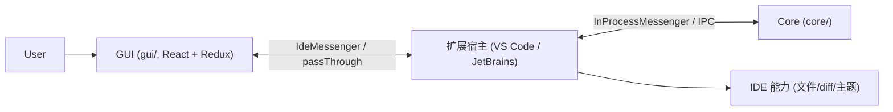

# `gui/` 模块架构文档

> Continue 运行在 IDE Webview 里的 React 前端。它是三方协议中的 **GUI/Webview** 角色，与 [`core/`](../core/README.md) 通过 `IdeMessenger` 通信。顶层全局视角见 [`../overview.md`](../overview.md)。

## 模块定位

## 文档索引

| 文档                                       | 内容                                                                                                                         |
| ------------------------------------------ | ---------------------------------------------------------------------------------------------------------------------------- |
| [overview.md](overview.md)                 | 职责、技术栈、两个入口（主 GUI vs Console）、目录结构、Provider 树、构建产物、设计模式                                       |
| [state-and-thunks.md](state-and-thunks.md) | Redux store / 7 个 slice / 关键 thunks、**Agent 对话循环**（streamNormalInput → callToolById → streamResponseAfterToolCall） |
| [ide-messaging.md](ide-messaging.md)       | `IdeMessenger`（request/streamRequest）、协议 passThrough、Core 推送监听、扩展侧加载                                         |

## 与 core 文档的关系

- GUI 侧的 Agent 对话循环是 [core/agent-conversation-flow](../core/agent-conversation-flow.md) 时序图的前端实现
- 通信协议定义见 [core/runtime-and-protocol](../core/runtime-and-protocol.md)

## 维护约定

GUI 发生架构级变更（新增 slice、新增/调整 Agent 对话 thunk、协议 passThrough 变化、入口或构建方式变化等）时，应同步更新本目录文档。
