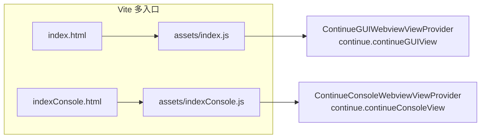

# GUI 总览

> 模块：`gui/`
> GUI 是运行在 IDE Webview 里的 React 前端，对应顶层 [overview](../overview.md) 与 [core/runtime-and-protocol](../core/runtime-and-protocol.md) 中三方协议的 **GUI/Webview** 角色。

## 1. 职责

负责 Chat / Agent 对话 UI、配置与历史、会话状态（Redux），并通过 `IdeMessenger` 经扩展桥接与 **Core**（LLM / 工具 / 上下文 / 索引）及 **IDE**（文件 / diff / 主题）通信。GUI 自身不直接调模型或读文件，所有副作用都以消息形式发给 Core / IDE。

## 2. 技术栈（`gui/package.json`）

| 类别     | 选型                                                                                                   |
| -------- | ------------------------------------------------------------------------------------------------------ |
| UI       | React 18.2、react-dom、react-router-dom 6.30                                                           |
| 状态     | @reduxjs/toolkit 2.x、react-redux、redux-persist 6（localStorage）                                     |
| 构建     | Vite 6、`@vitejs/plugin-react-swc`、TypeScript 5.6                                                     |
| 样式     | Tailwind 3 + styled-components 5（用 VS Code 主题变量 `--vscode-*`）                                   |
| 编辑器   | TipTap 2.x（主输入框）                                                                                 |
| 本地依赖 | `core`（`file:../core`，提供类型与协议）、`@continuedev/config-yaml`、`@continuedev/terminal-security` |
| 其它     | PostHog、Sentry、Mermaid、react-markdown                                                               |

## 3. 两个入口

| 入口        | 文件链                                        | 说明                                                                                                                                                                              |
| ----------- | --------------------------------------------- | --------------------------------------------------------------------------------------------------------------------------------------------------------------------------------- |
| **主 GUI**  | `index.html` → `src/main.tsx` → `src/App.tsx` | 完整产品界面：聊天、历史、配置、Agent 工具流；有 Redux + 持久化                                                                                                                   |
| **Console** | `indexConsole.html` → `src/console.tsx`       | 独立 Webview，**无 Redux**，只读展示 Core `LLMLogger` 的 prompt/completion/chunk 日志；走扩展自定义协议（`{type:"init"\|"item"}`），**不经** `IdeMessenger`/`FromWebviewProtocol` |

Vite 多入口（`gui/vite.config.ts`）打包出 `assets/index.js`+`index.css`（主 GUI）与 `assets/indexConsole.js`+`indexConsole.css`（Console）。



开发态：扩展 HTML 直接引用 `http://localhost:5173/src/main.tsx`（Vite dev server）。生产态：`scripts/install-dependencies.sh` 在 `gui/` 跑 `npm run build`（`tsc && vite build`），产物随 VS Code 扩展打包。

## 4. 目录结构（`gui/src/`）

| 目录                                                                    | 职责                                                                                                  |
| ----------------------------------------------------------------------- | ----------------------------------------------------------------------------------------------------- |
| `main.tsx` / `App.tsx`                                                  | 启动与路由壳                                                                                          |
| `console.tsx`                                                           | Console 独立入口                                                                                      |
| `pages/gui/`                                                            | 主聊天页：`index.tsx`（History 侧栏 + `Chat`）、`Chat.tsx`、`ToolCallDiv/*`、`StreamError.tsx`        |
| `pages/history/` `pages/config/` `pages/stats.tsx` `pages/AddNewModel/` | 历史、配置中心（models/rules/tools/indexing 等 tab）、Token 统计、模型配置数据                        |
| `components/mainInput/`                                                 | TipTap 主输入、`ContinueInputBox`、`AtMentionDropdown`、`Lump` 工具栏                                 |
| `components/StyledMarkdownPreview/`                                     | 助手消息 Markdown、代码块、Mermaid、Step 工具栏                                                       |
| `components/StepContainer/` `ToolCallDiv/` `History/` `TabBar/`         | 消息时间线、工具调用展示、历史、多会话 Tab                                                            |
| `components/modelSelection/` `ModeSelect/` `OnboardingCard/`            | 模型 / 模式选择、新用户引导                                                                           |
| `components/console/`                                                   | Console 专用 List/Details/Result                                                                      |
| `components/gui/` `components/ui/`                                      | 通用 UI（Button、Card、TabGroup 等）                                                                  |
| `redux/`                                                                | store、slices、thunks、selectors（见 [state-and-thunks](state-and-thunks.md)）                        |
| `context/`                                                              | `IdeMessenger`、`Auth`、`VscTheme`、`SubmenuContextProviders`（见 [ide-messaging](ide-messaging.md)） |
| `hooks/`                                                                | `ParallelListeners`、`useWebviewListener`、`useLLMLog`、`TelemetryProviders`                          |
| `forms/` `util/` `styles/`                                              | 表单、导航 / 客户端工具实现、主题变量                                                                 |

## 5. Provider 树（`App.tsx` + `Layout.tsx`）

```
VscThemeProvider
  MainEditorProvider
    SubmenuContextProvidersProvider
      RouterProvider (createMemoryRouter)
        Layout: LocalStorageProvider → AuthProvider → TelemetryProviders → Outlet
      ParallelListeners (无 UI，隔离全局 IDE/Core 监听)
```

因 Webview 无真实 URL，路由用 `createMemoryRouter` + `ROUTES`（`util/navigation.ts`）。`IdeMessenger` 通过 Context 默认值全局可用。

## 6. 设计模式与约定

| 约定                        | 说明                                                                                   |
| --------------------------- | -------------------------------------------------------------------------------------- |
| 协议驱动                    | 消息类型集中在 `core/protocol/*`；passThrough 白名单需与 IntelliJ 侧同步               |
| Thunk + 注入 `ideMessenger` | 副作用不直接 `postMessage`，统一走 `extra.ideMessenger`                                |
| Memory Router               | Webview 无 URL，用内存路由                                                             |
| 双通道工具                  | `CLIENT_TOOLS_IMPLS`（edit/find-replace）在 GUI 执行；其余经 `tools/call` 在 Core 执行 |
| `ParallelListeners` 隔离    | 全局 IDE/Core 监听与 `App` 渲染树分离，避免无关重渲染                                  |
| 样式分层                    | Tailwind 布局 + CSS 变量 `--vscode-*`；遗留组件用 styled-components `varWithFallback`  |
