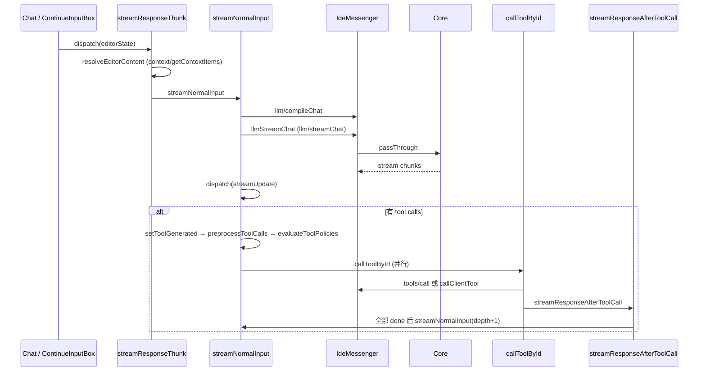

# GUI 状态管理与 Agent 对话循环

> 模块：`gui/src/redux/`

## 1. Store（`redux/store.ts`）

- `combineReducers` 合并 7 个 reducer：`session`、`ui`、`editModeState`、`config`、`indexing`、`tabs`、`profiles`
- **持久化**：`redux-persist` + `localStorage`，用 `createFilter` 只持久化部分字段（如 session 的 id/title/mode），**不**持久化完整 `history`
- **Thunk extra**：`extraArgument: { ideMessenger: IdeMessenger }`，所有副作用经它发消息（测试可 `setupStore({ ideMessenger: MockIdeMessenger })`）
- 中间件：RTK 默认 + `serializableCheck: false`；`redux-logger` 默认关闭

## 2. Slices

| Slice              | 名称            | 核心状态                                                                                                      |
| ------------------ | --------------- | ------------------------------------------------------------------------------------------------------------- |
| `sessionSlice.ts`  | `session`       | `history`、`isStreaming`、`streamAborter`、`mode`（默认 `"agent"`）、`toolCallStates`、`codeBlockApplyStates` |
| `configSlice.ts`   | `config`        | `BrowserSerializedContinueConfig`、`configError`、`loading`                                                   |
| `uiSlice.ts`       | `ui`            | 对话框、onboarding、`toolSettings`/`ruleSettings`/`reasoningSettings`                                         |
| `editState.ts`     | `editModeState` | `codeToEdit`、`applyState`、编辑模式回退                                                                      |
| `indexingSlice.ts` | `indexing`      | 文档 / 索引状态映射                                                                                           |
| `tabsSlice.ts`     | `tabs`          | 多 Chat Tab                                                                                                   |
| `profilesSlice.ts` | `profiles`      | 组织 / Profile 选择与偏好                                                                                     |

`sessionSlice` 是核心：`streamUpdate` reducer 合并流式文本、reasoning，并通过 `handleStreamingToolCallUpdates` / `applyToolCallDelta` 增量拼接 tool call 参数；`toolCallStates` 维护工具状态机（`generating → generated → calling → done`）。

## 3. 关键 Thunks

| Thunk                                        | 文件                                    | 作用                                                                        |
| -------------------------------------------- | --------------------------------------- | --------------------------------------------------------------------------- |
| `streamResponseThunk`                        | `streamResponse.ts`                     | 用户提交入口：`resolveEditorContent` → 写入 user 消息 → `streamNormalInput` |
| `streamNormalInput`                          | `streamNormalInput.ts`                  | 编译消息、`llmStreamChat`、`streamUpdate`、工具生成 / 策略 / 执行调度       |
| `callToolById`                               | `callToolById.ts`                       | 客户端工具或 Core `tools/call` → 更新输出 → `streamResponseAfterToolCall`   |
| `streamResponseAfterToolCall`                | `streamResponseAfterToolCall.ts`        | 注入 `role:"tool"` 消息；全部工具完成后再次 `streamNormalInput`             |
| `streamThunkWrapper`                         | `streamThunkWrapper.tsx`                | 统一 try/catch、错误对话框、`saveCurrentSession`                            |
| `cancelStream` / `cancelToolCallThunk`       | `cancelStream.ts` / `cancelToolCall.ts` | 取消整条流 / 单个工具                                                       |
| `streamEditThunk` / `enterEdit` / `exitEdit` | `edit.ts`                               | 行内编辑模式（`edit/sendPrompt`，非 Agent 主循环）                          |
| `saveCurrentSession` / `loadSession`         | `session.ts`                            | `history/save`、`history/load`                                              |
| `handleApplyStateUpdate`                     | `handleApplyStateUpdate.ts`             | Apply diff 状态                                                             |

辅助（普通函数，非 thunk）：`evaluateToolPolicies`（调 `tools/evaluatePolicy`）、`preprocessToolCalls`（调 `tools/preprocessArgs`）。

## 4. Agent 对话循环（Redux 侧）

`streamNormalInput` 主要步骤：

1. `constructMessages` + `llm/compileChat`
2. `llmStreamChat` → 循环 `dispatch(streamUpdate(next.value))`
3. `setToolGenerated` → `preprocessToolCalls` → `evaluateToolPolicies`
4. 需审批：只自动跑 readonly built-in 工具；否则 `setInactive` 等用户点接受
5. 自动批准：`callToolById`；无 pending 时对已生成工具走 `streamResponseAfterToolCall`

工具结果写回历史后，`streamResponseAfterToolCall` 在全部工具完成时再次 `streamNormalInput`（`depth` 递增，测试上限 50），形成**多轮循环**——这正是 [core/agent-conversation-flow](../core/agent-conversation-flow.md) 时序图中循环的 GUI 侧实现。

取消：`cancelStream` → `abortStream()` 使 `streamAborter` 触发 `IdeMessenger` 发 `abort`。

## 5. 渲染链路

`Chat.renderChatHistoryItem` → `StepContainer` + `StyledMarkdownPreview` 渲染助手消息；工具调用渲染为 `ToolCallDiv`（`ToolCallDisplay`、`RunTerminalCommand` 等）；Core 长任务通过 `toolCallPartialOutput` 推增量，`Chat.tsx` 监听并 `updateToolCallOutput` 实时刷新 UI。
