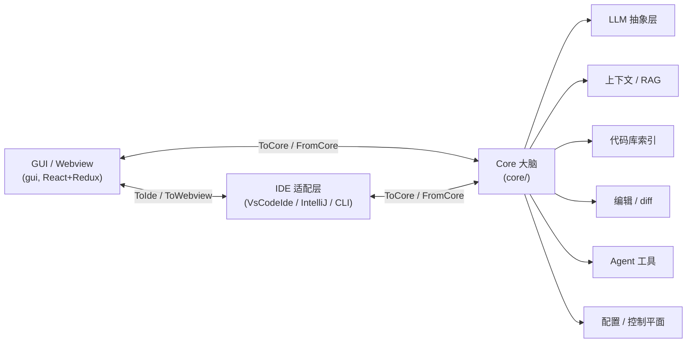

# Continue 架构总览

> 面向贡献者的内部架构说明。产品/用户文档见 `docs/`（Mintlify 站点）。

## 一、项目定位

Continue 是一个开源 AI 编程助手。核心能力已演进为 **"源码可控、可在 CI 中强制执行的 AI 检查"**（在 PR 上以 GitHub status check 形式运行 agent），同时保留 IDE 内的 Chat / 自动补全 / 编辑 / Agent 能力。

整个仓库是一个 **monorepo**：一份与宿主无关的"大脑"（`core`），通过强类型消息协议复用到多个宿主（VS Code、IntelliJ、CLI、Hub）。

## 二、顶层结构

```
continue/
├── core/         # 核心引擎（与宿主无关的纯 TS 大脑）
├── extensions/
│   ├── vscode/   # VS Code 扩展（TS）
│   ├── intellij/ # IntelliJ 插件（Kotlin/JVM，通过 binary 内嵌 core）
│   └── cli/      # 命令行工具 cn（@continuedev/cli）
├── gui/          # 前端 UI（React + Redux + Vite，运行在 webview 中）
├── binary/       # 把 core 打包成独立可执行进程（供 IntelliJ 等通过 IPC 调用）
├── packages/     # 可独立发布的共享库（config、fetch、llm-info、openai-adapters、sdk…）
├── sync/         # Rust 实现的高性能同步/索引组件
├── eval/         # 评测
└── docs/         # 产品文档（Mintlify .mdx 站点）
```

## 三、核心架构：三方消息通信模型

最关键的设计是 **三个角色通过强类型消息协议解耦**，协议定义在 `core/protocol/`：

```
// core/protocol/index.ts
ToIdeProtocol     = ToIdeFromWebviewProtocol & ToIdeFromCoreProtocol
ToWebviewProtocol = ToWebviewFromIdeProtocol & ToWebviewFromCoreProtocol & ToWebviewOrCoreFromIdeProtocol
ToCoreProtocol    = ToCoreFromIdeProtocol & ToCoreFromWebviewProtocol & ToWebviewOrCoreFromIdeProtocol
```

三个角色：

| 角色              | 职责                                                               | 实现位置                 |
| ----------------- | ------------------------------------------------------------------ | ------------------------ |
| **Core**          | 与宿主无关的"大脑"：LLM 调用、补全、编辑、索引、上下文、工具、配置 | `core/`                  |
| **IDE**           | 宿主适配层，提供文件系统、终端、编辑器等能力（`IDE` 接口）         | 各 `extensions/*` 的实现 |
| **GUI / Webview** | 用户界面（聊天、设置、diff 预览等）                                | `gui/`                   |

三者之间靠 `IMessenger`（`core/protocol/messenger/`）传递类型化消息，互不直接依赖。这正是同一个 `core` 能跑在 VS Code、IntelliJ（经 `binary` 起独立进程做 IPC）和 CLI 三种宿主的原因。

入口类是 `Core`（`core/core.ts`），构造时注册大量消息 handler，对外只暴露两个方法：

- `invoke(messageType, data)`：请求-响应
- `send(messageType, data, messageId?)`：推送



## 四、Core 内部模块

> 各模块的细化架构设计见 [`core/`](core/README.md) 子目录文档。

| 目录                  | 职责                                                                                                                                       |
| --------------------- | ------------------------------------------------------------------------------------------------------------------------------------------ |
| `core/llm/`           | LLM 抽象层。`llms/` 下有约 **79 个 provider**（OpenAI、Anthropic、Ollama、Gemini…）、token 计数、流式 chat、模板、系统消息                 |
| `core/autocomplete/`  | 行内代码自动补全（`CompletionProvider`），含上下文采集、缓存、过滤                                                                         |
| `core/nextEdit/`      | "Next Edit" 预测下一处编辑（预取队列 + diff 处理）                                                                                         |
| `core/edit/`          | 应用编辑、流式 diff（`streamDiffLines`）                                                                                                   |
| `core/context/`       | 上下文系统：`providers/`（30+ 种 @ 上下文：文件、代码库、Git、Jira、Docs、MCP…）、`retrieval/`（RAG 检索）、`mcp/`（MCP 协议管理 + OAuth） |
| `core/indexing/`      | 代码库索引：`LanceDbIndex`（向量）、`FullTextSearchCodebaseIndex`（全文）、`CodeSnippetsIndex`、分块、忽略规则                             |
| `core/config/`        | 配置加载（`ConfigHandler`）、本地/Hub assistant、规则、迁移、onboarding                                                                    |
| `core/tools/`         | Agent 可调用的工具（`callTool`）                                                                                                           |
| `core/commands/`      | 斜杠命令（含 MCP slash command）                                                                                                           |
| `core/control-plane/` | 连接 Continue Hub / 控制平面：鉴权、env、MDM 许可                                                                                          |
| `core/data/`          | 开发数据日志（dev data，SQLite）                                                                                                           |
| `core/util/`          | 通用工具：历史、token、tree-sitter 符号、TTS、遥测（PostHog）、会话压缩等                                                                  |

## 五、宿主客户端

> GUI（webview 前端）的细化架构见 [`gui/`](gui/README.md) 子目录文档。

- **VS Code**（`extensions/vscode/src/`）：`VsCodeIde.ts` 实现 `IDE` 接口；`ContinueGUIWebviewViewProvider` / `ContinueConsoleWebviewViewProvider` 加载 `gui` 的 webview；含 autocomplete、apply、diff、terminal、quickEdit 等集成。`core` 直接以 TS 形式内嵌运行。
- **IntelliJ**（`extensions/intellij/`，Kotlin）：自身用 JVM 写 UI/IDE 适配，`core` 以 `binary/` 打包出的独立 Node 进程运行，两者通过 IPC（stdin/stdout 消息）通信。
- **CLI `cn`**（`extensions/cli/src/`）：无头/TUI 形态，支持 `session`、`subagent`、`permissions`、`stream`、`compaction`、`slashCommands`、`mcp`、`hooks` 等；是 README 主推的 AI checks 能力的载体。

## 六、共享包（`packages/`，可独立发布到 npm/PyPI）

- `config-yaml` / `config-types`：assistant 配置 schema 与解析
- `openai-adapters`：把各家模型 API 适配成 OpenAI 接口形态
- `llm-info`：模型元数据（上下文窗口、价格等）
- `fetch`：带 request options 的统一 fetch
- `continue-sdk`：对外 SDK（TypeScript + Python，含生成的 API client）
- `hub` / `terminal-security`：Hub 集成与终端安全策略

## 七、典型数据流（以 IDE 内一次聊天为例）

1. 用户在 **GUI**（React/Redux）输入 → 通过 webview messenger 发送 `ToCore` 消息
2. **Core** 收到后，用 `context/providers` + `indexing`/`retrieval` 收集上下文
3. 经 `config` 选定模型，调用 `llm/streamChat` → 对应 provider
4. 流式结果通过 `FromCore` 消息推回 **GUI** 渲染；若是 Agent 模式则经 `tools/callTool` 调用工具，需要文件/终端能力时再经协议回调 **IDE**（如 `VsCodeIde`）执行
5. 编辑结果由 `edit/streamDiffLines` 生成 diff，回传 GUI/IDE 做预览与 apply

## 八、一句话总结

一个与宿主无关的 `core` 大脑，通过强类型三方消息协议（IDE / GUI / Core）解耦，复用到 VS Code、IntelliJ、CLI 多个宿主；LLM、上下文、索引、编辑、工具等都是 `core` 内可插拔的子系统，配置与模型则通过 `packages` 共享库和 Hub 控制平面统一管理。
